# AuraTune system-level use-case model
Performed by: Group 10 Requirements Engineering Team | Reviewed by: Group 10 team | Edited by: Lê Công Minh Nhựt

## 1. Document information
Performed by: Group 10 Requirements Engineering Team | Reviewed by: Group 10 team | Edited by: Lê Công Minh Nhựt

Version: 1.1.0, PA4 review draft, 2026-11-20. Original authors: Group 10 Requirements Engineering Team. Independent review is pending.

The owner confirmed that TA supplied no PA3 feedback and requested more detail in the current version. The owner subsequently confirmed that the original documents before this PA4 revision are the PA3 baseline (PA4-D07). This is the pre-edit snapshot recorded at HEAD `35d8027`, with each original document identified by its recorded SHA-256 hash.

This model preserves the existing UC specification IDs and filenames under owner decision PA4-D02. The Vision retains its historical IDs; Section 9 supplies an explicit goal-based crosswalk. [Review register](#11-pa4-decisions-and-source-review) records source conflicts and implementation limits.

## 2. System overview and boundary
Performed by: Group 10 Requirements Engineering Team | Reviewed by: Group 10 team | Edited by: Lê Công Minh Nhựt

AuraTune supports music discovery, playback, personal collections, Artist Studio, administration and conversational assistance. The model states required observable behavior; it does not certify that every feature is implemented.

The application UI, Express API, Python orchestration and application-owned data are inside the logical AuraTune boundary. Identity providers, cloud media storage and third-party model services are outside. Internal Player, Queue, analysis logic, databases and background jobs are not external human actors. Browser storage is a client persistence mechanism, not an actor.

The Vision requires licensed/authorized media and privacy protections. Those are requirements to verify, rather than a claim of legal compliance established by this model. Spotify is described in the Vision as an offline metadata preparation source, not a runtime user actor.

## 3. Actors
Performed by: Group 10 Requirements Engineering Team | Reviewed by: Group 10 team | Edited by: Lê Công Minh Nhựt

| Actor | Boundary and permissions |
| --- | --- |
| ACT-01 Guest / Visitor / Public User | Public discovery and permitted playback; registration/login are entry goals. Source-specific restrictions still apply, including Listener-only semantic search under PA4-D05. |
| ACT-02 Listener | Authenticated access to the account's own collections, history, recommendations and chat. |
| Playlist Owner | Listener with ownership of the selected playlist; permissions do not apply to other playlists. |
| ACT-03 Playlist Collaborator / Editor / Participant | Resource-specific invited co-editing and viewing, subject to the collaboration spec. Ownership-only actions remain with the owner. |
| ACT-04 Artist | Listener capabilities plus management of the Artist's own Studio. An Admin role does not confer Artist Studio impersonation. |
| ACT-05 Administrator | Listener capabilities plus authorized platform administration, subject to self-management restrictions. |
| ACT-EXT-01 Google; ACT-EXT-02 Facebook | External identity verification. Session issuance and account authorization remain AuraTune responsibilities. |
| ACT-EXT-03 Cloud media storage | Logical external upload/delivery role. Cloudinary integration is present; no Cloudflare deployment is inferred. |
| ACT-EXT-04 External AI provider | External model inference where a goal requires it. Feature 101 history-only statistical aggregation is internal. |

Role specialization inherits public/user capabilities, not every entry flow's preconditions. Resource ownership, current ban/session state and feature-specific access always constrain an inherited capability.

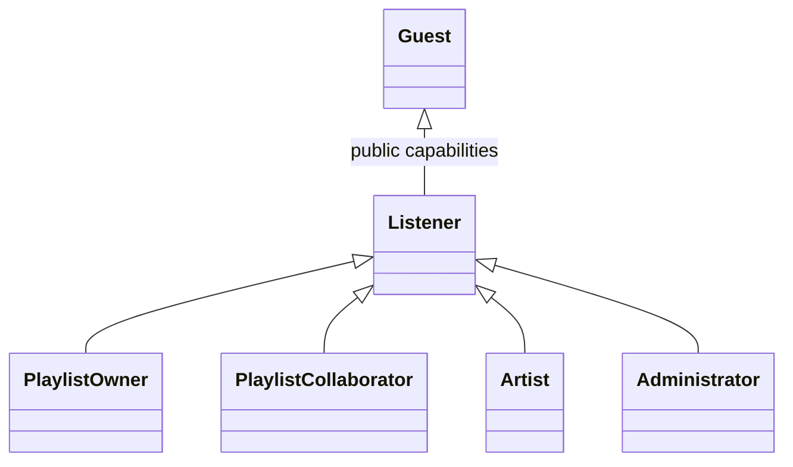
```mermaid
classDiagram
 direction BT
 class Guest
 class Listener
 class PlaylistOwner
 class PlaylistCollaborator
 class Artist
 class Administrator
 Listener --|> Guest : public capabilities
 PlaylistOwner --|> Listener
 PlaylistCollaborator --|> Listener
 Artist --|> Listener
 Administrator --|> Listener
```

## 4. Functional groups and source coverage
Performed by: Group 10 Requirements Engineering Team | Reviewed by: Group 10 team | Edited by: Lê Công Minh Nhựt

| Group | Draft specifications | Source inventory | Review state |
| --- | ---: | --- | --- |
| 010 Authentication | 9 | [Inventory](./use-cases/010-authentication/use-case-inventory.md) | Pending PA4 peer review; see source/implementation gaps |
| 020 Home Dashboard | 5 | [Inventory](./use-cases/020-home-dashboard/use-case-inventory.md) | Pending PA4 peer review; see source/implementation gaps |
| 030 Search | 4 | [Inventory](./use-cases/030-search/use-case-inventory.md) | Pending PA4 peer review; see source/implementation gaps |
| 040 Music Player | 10 | [Inventory](./use-cases/040-music-player/use-case-inventory.md) | Pending PA4 peer review; see source/implementation gaps |
| 050 Queue Management | 7 | [Inventory](./use-cases/050-queue-management/use-case-inventory.md) | Pending PA4 peer review; see source/implementation gaps |
| 060 Playlist Management | 16 | [Inventory](./use-cases/060-playlist-management/use-case-inventory.md) | Pending PA4 peer review; see source/implementation gaps |
| 070 Listening History | 7 | [Inventory](./use-cases/070-listening-history/use-case-inventory.md) | Pending PA4 peer review; see source/implementation gaps |
| 080 Album Interaction | 3 | [Inventory](./use-cases/080-album-interaction/use-case-inventory.md) | Pending PA4 peer review; see source/implementation gaps |
| 090 Artist Profile and Studio | 8 | [Inventory](./use-cases/090-artist-profile-studio/use-case-inventory.md) | Pending PA4 peer review; see source/implementation gaps |
| 100 AI Recommendations | 3 | [Inventory](./use-cases/100-ai-recommendations/use-case-inventory.md) | Pending PA4 peer review; see source/implementation gaps |
| 110 Admin Functions | 8 | [Inventory](./use-cases/110-admin-functions/use-case-inventory.md) | Pending PA4 peer review; see source/implementation gaps |
| 120 AI Conversational Agent | 4 | [Inventory](./use-cases/120-ai-conversational-agent/use-case-inventory.md) | Pending PA4 peer review; see source/implementation gaps |

There are 84 specification files across twelve groups. This is a file/catalog count, not a coverage percentage or completed-feature count. UC-070-001 records an internal playback-triggered process for a Listener; UC-070-007 documents a retention policy without an interactive user goal. They are retained for traceability and are not new external actors.

## 5. Group use-case diagrams
Performed by: Group 10 Requirements Engineering Team | Reviewed by: Group 10 team | Edited by: Lê Công Minh Nhựt

Each diagram shows a human role association to its catalog goals. Role labels are abbreviated; the specifications and actor table define actual authority. An association to a background policy indicates its beneficiary, not that the user manually invokes the job.

### 010: Authentication
Performed by: Group 10 Requirements Engineering Team | Reviewed by: Group 10 team | Edited by: Lê Công Minh Nhựt

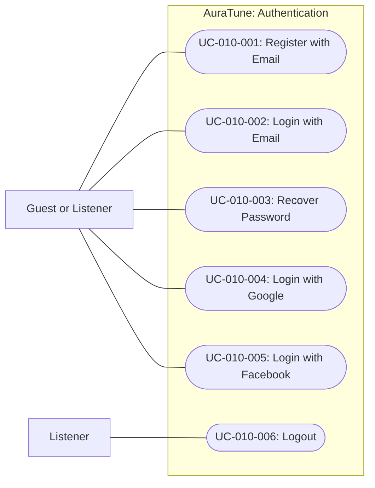
```mermaid
flowchart LR
 A0["Guest or Listener"]
 A1["Listener"]
 subgraph B["AuraTune: Authentication"]
 UUC010001(["UC-010-001: Register with Email"])
 UUC010002(["UC-010-002: Login with Email"])
 UUC010003(["UC-010-003: Recover Password"])
 UUC010004(["UC-010-004: Login with Google"])
 UUC010005(["UC-010-005: Login with Facebook"])
 UUC010006(["UC-010-006: Logout"])
 end
 A0 --- UUC010001
 A0 --- UUC010002
 A0 --- UUC010003
 A0 --- UUC010004
 A0 --- UUC010005
 A1 --- UUC010006
```

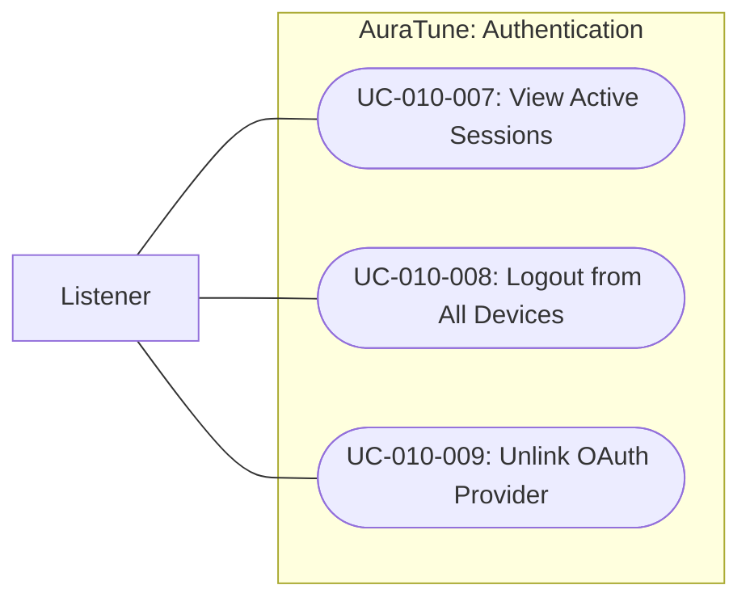
```mermaid
flowchart LR
 A1["Listener"]
 subgraph B["AuraTune: Authentication"]
 UUC010007(["UC-010-007: View Active Sessions"])
 UUC010008(["UC-010-008: Logout from All Devices"])
 UUC010009(["UC-010-009: Unlink OAuth Provider"])
 end
 A1 --- UUC010007
 A1 --- UUC010008
 A1 --- UUC010009
```

### 020: Home Dashboard
Performed by: Group 10 Requirements Engineering Team | Reviewed by: Group 10 team | Edited by: Lê Công Minh Nhựt

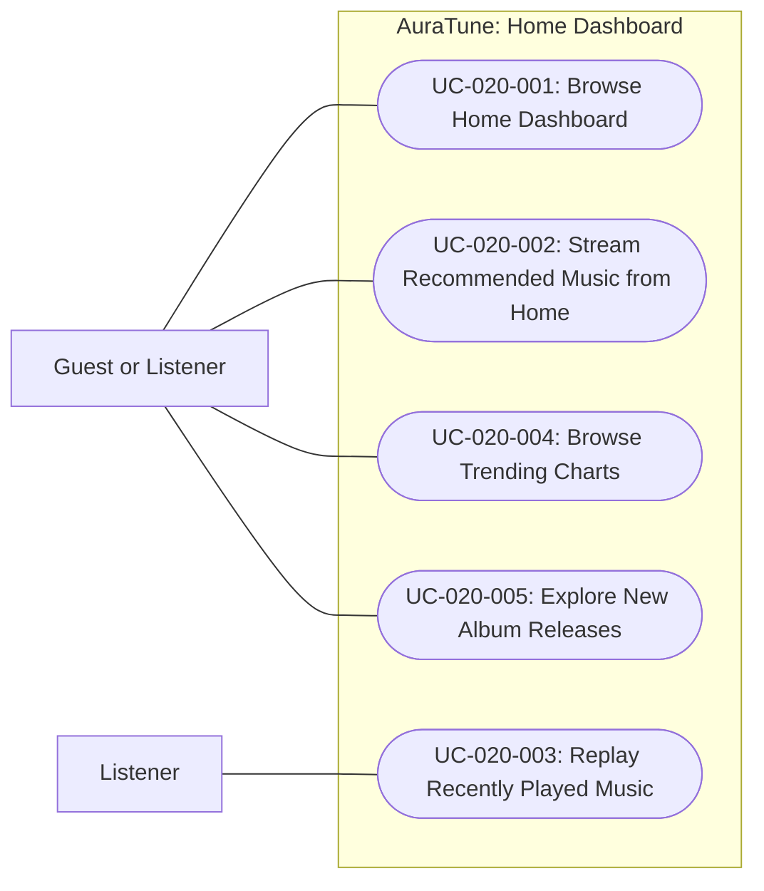
```mermaid
flowchart LR
 A0["Guest or Listener"]
 A1["Listener"]
 subgraph B["AuraTune: Home Dashboard"]
 UUC020001(["UC-020-001: Browse Home Dashboard"])
 UUC020002(["UC-020-002: Stream Recommended Music from Home"])
 UUC020003(["UC-020-003: Replay Recently Played Music"])
 UUC020004(["UC-020-004: Browse Trending Charts"])
 UUC020005(["UC-020-005: Explore New Album Releases"])
 end
 A0 --- UUC020001
 A0 --- UUC020002
 A1 --- UUC020003
 A0 --- UUC020004
 A0 --- UUC020005
```

### 030: Search
Performed by: Group 10 Requirements Engineering Team | Reviewed by: Group 10 team | Edited by: Lê Công Minh Nhựt

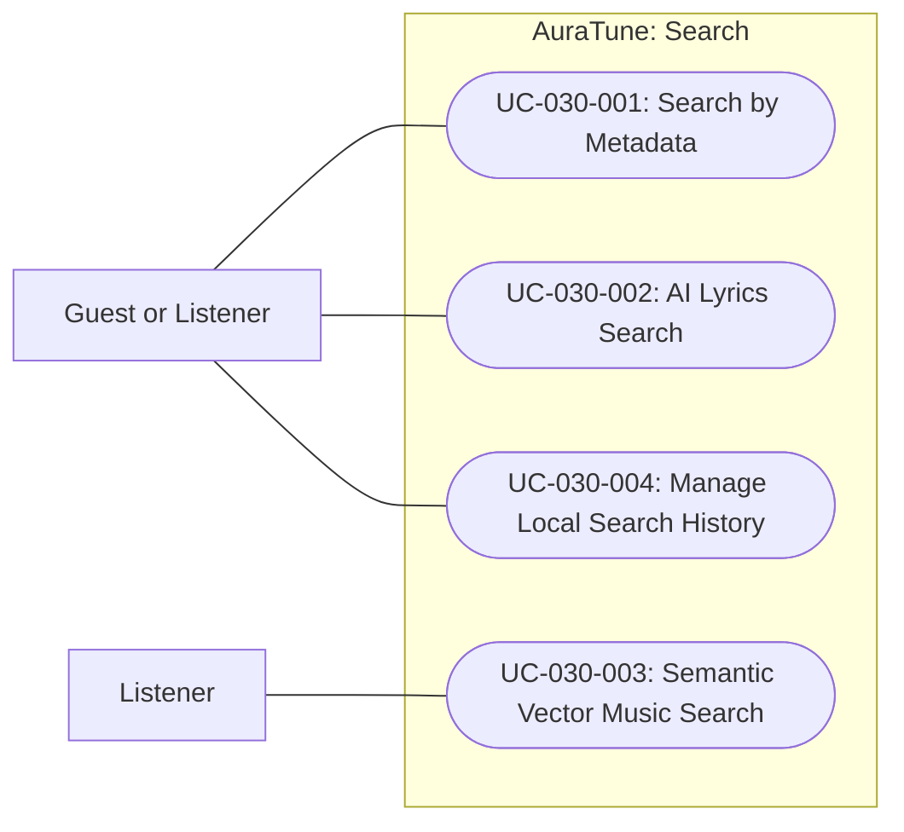
```mermaid
flowchart LR
 A0["Guest or Listener"]
 A1["Listener"]
 subgraph B["AuraTune: Search"]
 UUC030001(["UC-030-001: Search by Metadata"])
 UUC030002(["UC-030-002: AI Lyrics Search"])
 UUC030003(["UC-030-003: Semantic Vector Music Search"])
 UUC030004(["UC-030-004: Manage Local Search History"])
 end
 A0 --- UUC030001
 A0 --- UUC030002
 A1 --- UUC030003
 A0 --- UUC030004
```

### 040: Music Player
Performed by: Group 10 Requirements Engineering Team | Reviewed by: Group 10 team | Edited by: Lê Công Minh Nhựt

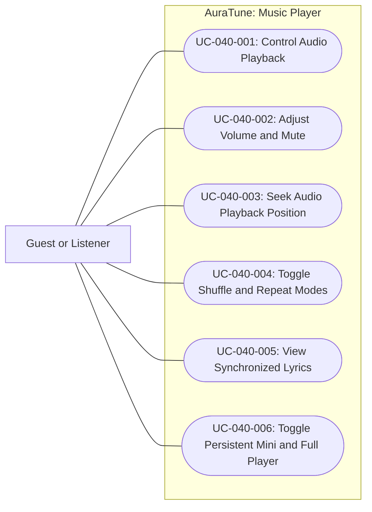
```mermaid
flowchart LR
 A0["Guest or Listener"]
 subgraph B["AuraTune: Music Player"]
 UUC040001(["UC-040-001: Control Audio Playback"])
 UUC040002(["UC-040-002: Adjust Volume and Mute"])
 UUC040003(["UC-040-003: Seek Audio Playback Position"])
 UUC040004(["UC-040-004: Toggle Shuffle and Repeat Modes"])
 UUC040005(["UC-040-005: View Synchronized Lyrics"])
 UUC040006(["UC-040-006: Toggle Persistent Mini and Full Player"])
 end
 A0 --- UUC040001
 A0 --- UUC040002
 A0 --- UUC040003
 A0 --- UUC040004
 A0 --- UUC040005
 A0 --- UUC040006
```

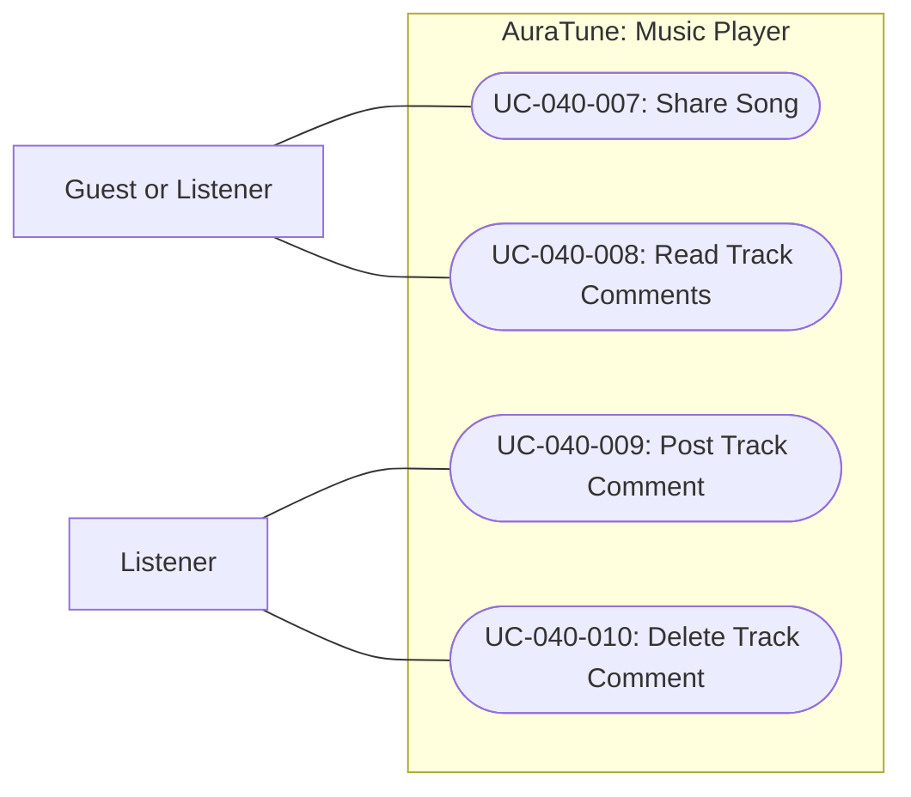
```mermaid
flowchart LR
 A0["Guest or Listener"]
 A1["Listener"]
 subgraph B["AuraTune: Music Player"]
 UUC040007(["UC-040-007: Share Song"])
 UUC040008(["UC-040-008: Read Track Comments"])
 UUC040009(["UC-040-009: Post Track Comment"])
 UUC040010(["UC-040-010: Delete Track Comment"])
 end
 A0 --- UUC040007
 A0 --- UUC040008
 A1 --- UUC040009
 A1 --- UUC040010
```

### 050: Queue Management
Performed by: Group 10 Requirements Engineering Team | Reviewed by: Group 10 team | Edited by: Lê Công Minh Nhựt

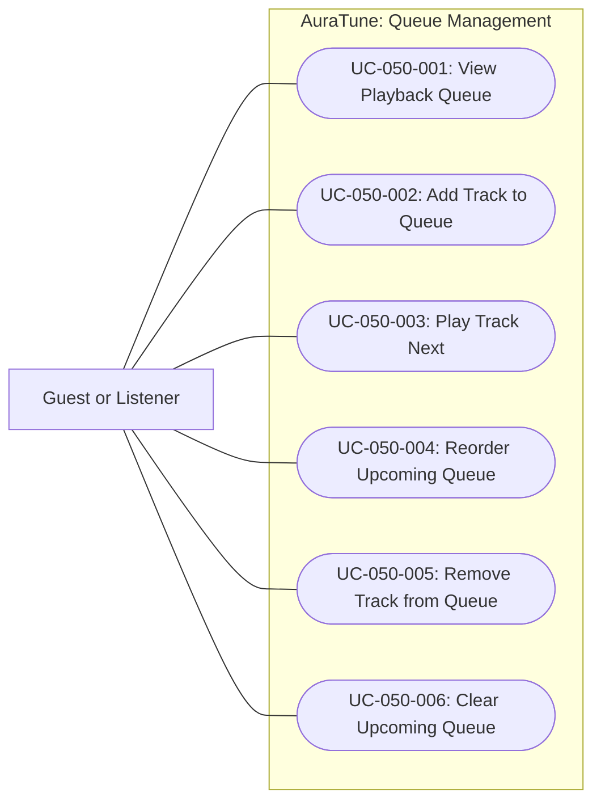
```mermaid
flowchart LR
 A0["Guest or Listener"]
 subgraph B["AuraTune: Queue Management"]
 UUC050001(["UC-050-001: View Playback Queue"])
 UUC050002(["UC-050-002: Add Track to Queue"])
 UUC050003(["UC-050-003: Play Track Next"])
 UUC050004(["UC-050-004: Reorder Upcoming Queue"])
 UUC050005(["UC-050-005: Remove Track from Queue"])
 UUC050006(["UC-050-006: Clear Upcoming Queue"])
 end
 A0 --- UUC050001
 A0 --- UUC050002
 A0 --- UUC050003
 A0 --- UUC050004
 A0 --- UUC050005
 A0 --- UUC050006
```

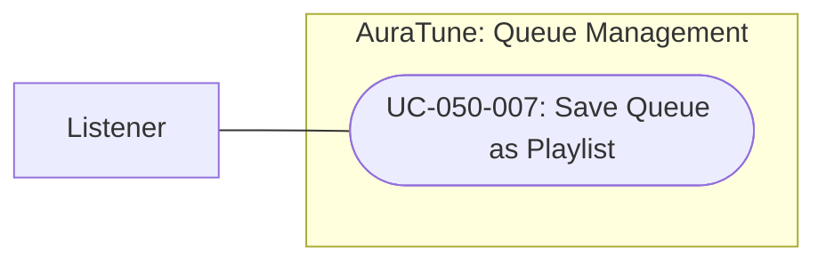
```mermaid
flowchart LR
 A1["Listener"]
 subgraph B["AuraTune: Queue Management"]
 UUC050007(["UC-050-007: Save Queue as Playlist"])
 end
 A1 --- UUC050007
```

### 060: Playlist Management
Performed by: Group 10 Requirements Engineering Team | Reviewed by: Group 10 team | Edited by: Lê Công Minh Nhựt

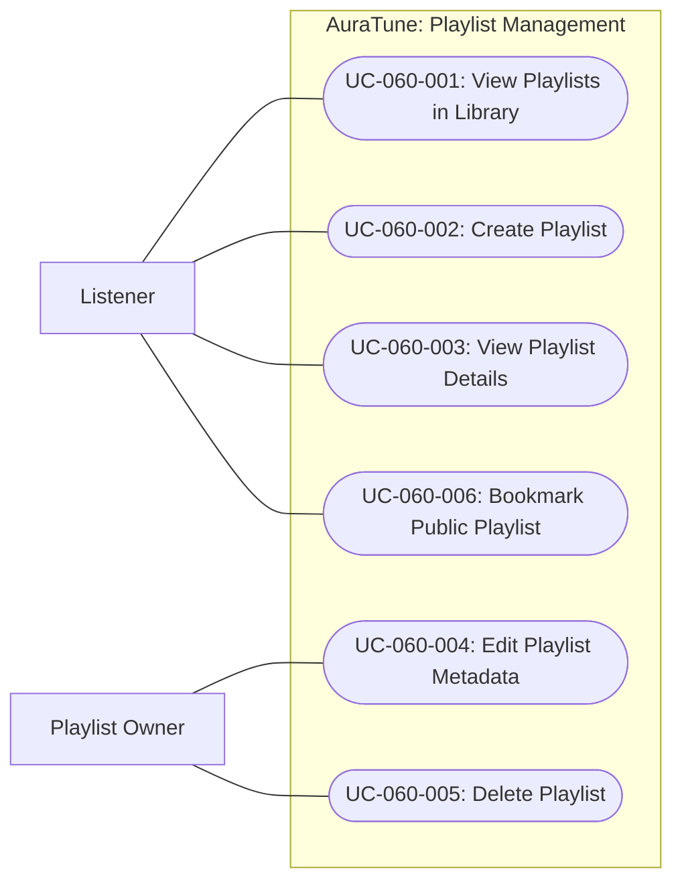
```mermaid
flowchart LR
 A0["Listener"]
 A1["Playlist Owner"]
 subgraph B["AuraTune: Playlist Management"]
 UUC060001(["UC-060-001: View Playlists in Library"])
 UUC060002(["UC-060-002: Create Playlist"])
 UUC060003(["UC-060-003: View Playlist Details"])
 UUC060004(["UC-060-004: Edit Playlist Metadata"])
 UUC060005(["UC-060-005: Delete Playlist"])
 UUC060006(["UC-060-006: Bookmark Public Playlist"])
 end
 A0 --- UUC060001
 A0 --- UUC060002
 A0 --- UUC060003
 A1 --- UUC060004
 A1 --- UUC060005
 A0 --- UUC060006
```

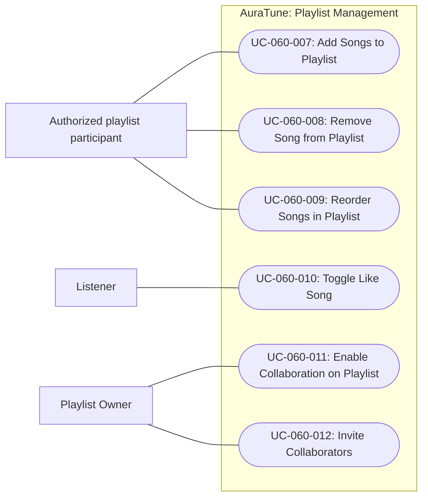
```mermaid
flowchart LR
 A0["Listener"]
 A1["Playlist Owner"]
 A2["Authorized playlist participant"]
 subgraph B["AuraTune: Playlist Management"]
 UUC060007(["UC-060-007: Add Songs to Playlist"])
 UUC060008(["UC-060-008: Remove Song from Playlist"])
 UUC060009(["UC-060-009: Reorder Songs in Playlist"])
 UUC060010(["UC-060-010: Toggle Like Song"])
 UUC060011(["UC-060-011: Enable Collaboration on Playlist"])
 UUC060012(["UC-060-012: Invite Collaborators"])
 end
 A2 --- UUC060007
 A2 --- UUC060008
 A2 --- UUC060009
 A0 --- UUC060010
 A1 --- UUC060011
 A1 --- UUC060012
```

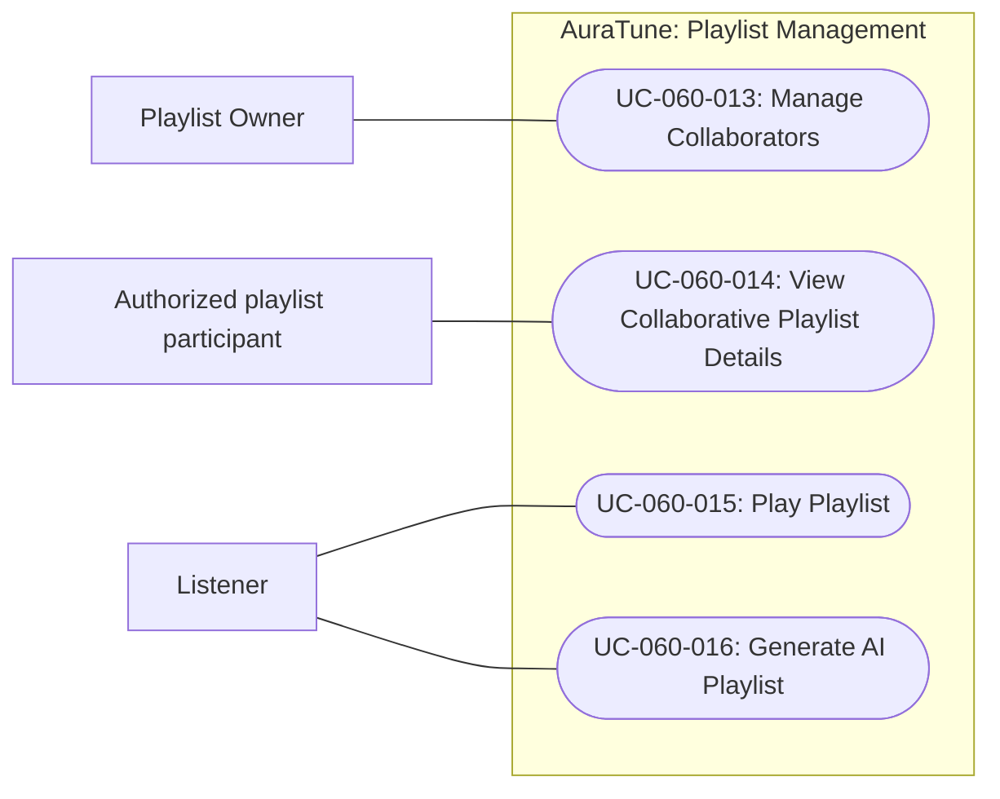
```mermaid
flowchart LR
 A0["Listener"]
 A1["Playlist Owner"]
 A2["Authorized playlist participant"]
 subgraph B["AuraTune: Playlist Management"]
 UUC060013(["UC-060-013: Manage Collaborators"])
 UUC060014(["UC-060-014: View Collaborative Playlist Details"])
 UUC060015(["UC-060-015: Play Playlist"])
 UUC060016(["UC-060-016: Generate AI Playlist"])
 end
 A1 --- UUC060013
 A2 --- UUC060014
 A0 --- UUC060015
 A0 --- UUC060016
```

### 070: Listening History
Performed by: Group 10 Requirements Engineering Team | Reviewed by: Group 10 team | Edited by: Lê Công Minh Nhựt

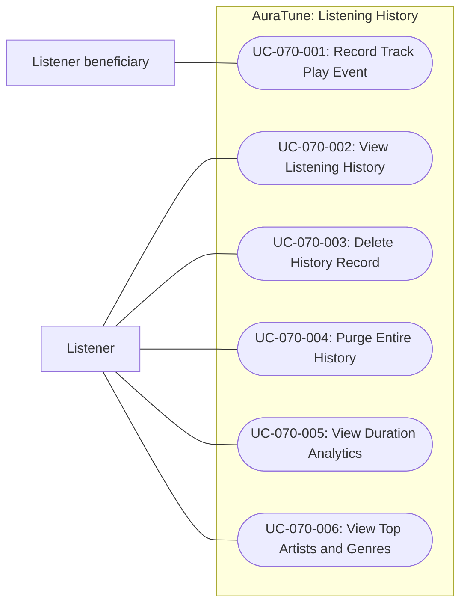
```mermaid
flowchart LR
 A0["Listener beneficiary"]
 A1["Listener"]
 subgraph B["AuraTune: Listening History"]
 UUC070001(["UC-070-001: Record Track Play Event"])
 UUC070002(["UC-070-002: View Listening History"])
 UUC070003(["UC-070-003: Delete History Record"])
 UUC070004(["UC-070-004: Purge Entire History"])
 UUC070005(["UC-070-005: View Duration Analytics"])
 UUC070006(["UC-070-006: View Top Artists and Genres"])
 end
 A0 --- UUC070001
 A1 --- UUC070002
 A1 --- UUC070003
 A1 --- UUC070004
 A1 --- UUC070005
 A1 --- UUC070006
```

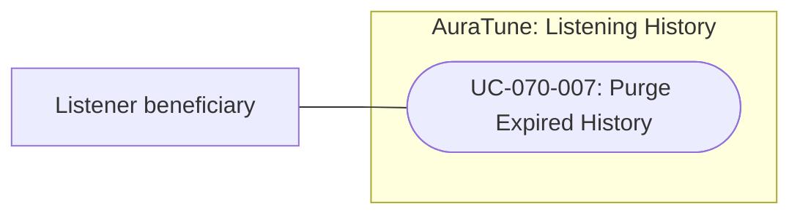
```mermaid
flowchart LR
 A0["Listener beneficiary"]
 subgraph B["AuraTune: Listening History"]
 UUC070007(["UC-070-007: Purge Expired History"])
 end
 A0 --- UUC070007
```

### 080: Album Interaction
Performed by: Group 10 Requirements Engineering Team | Reviewed by: Group 10 team | Edited by: Lê Công Minh Nhựt

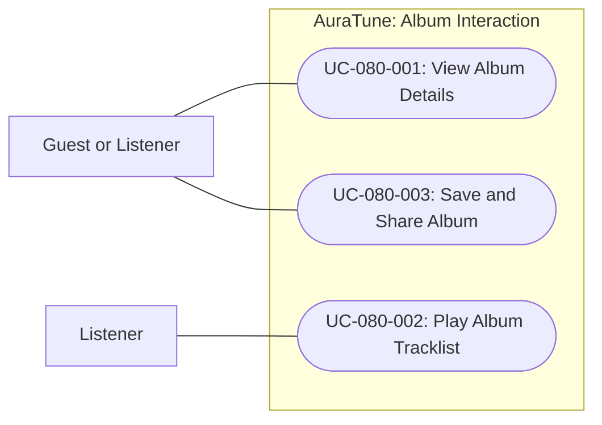
```mermaid
flowchart LR
 A0["Guest or Listener"]
 A1["Listener"]
 subgraph B["AuraTune: Album Interaction"]
 UUC080001(["UC-080-001: View Album Details"])
 UUC080002(["UC-080-002: Play Album Tracklist"])
 UUC080003(["UC-080-003: Save and Share Album"])
 end
 A0 --- UUC080001
 A1 --- UUC080002
 A0 --- UUC080003
```

### 090: Artist Profile and Studio
Performed by: Group 10 Requirements Engineering Team | Reviewed by: Group 10 team | Edited by: Lê Công Minh Nhựt

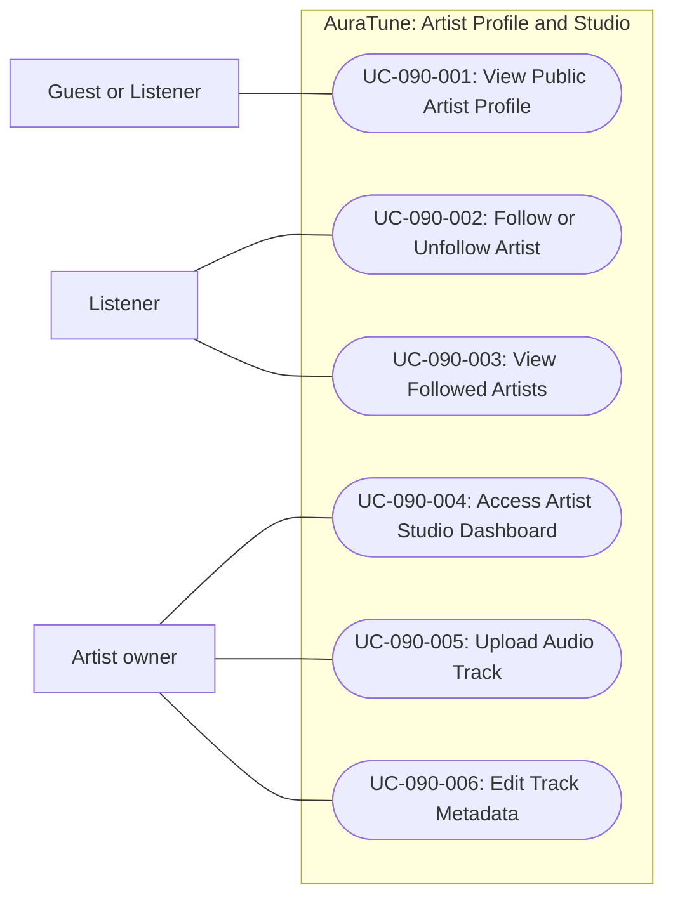
```mermaid
flowchart LR
 A0["Guest or Listener"]
 A1["Listener"]
 A2["Artist owner"]
 subgraph B["AuraTune: Artist Profile and Studio"]
 UUC090001(["UC-090-001: View Public Artist Profile"])
 UUC090002(["UC-090-002: Follow or Unfollow Artist"])
 UUC090003(["UC-090-003: View Followed Artists"])
 UUC090004(["UC-090-004: Access Artist Studio Dashboard"])
 UUC090005(["UC-090-005: Upload Audio Track"])
 UUC090006(["UC-090-006: Edit Track Metadata"])
 end
 A0 --- UUC090001
 A1 --- UUC090002
 A1 --- UUC090003
 A2 --- UUC090004
 A2 --- UUC090005
 A2 --- UUC090006
```

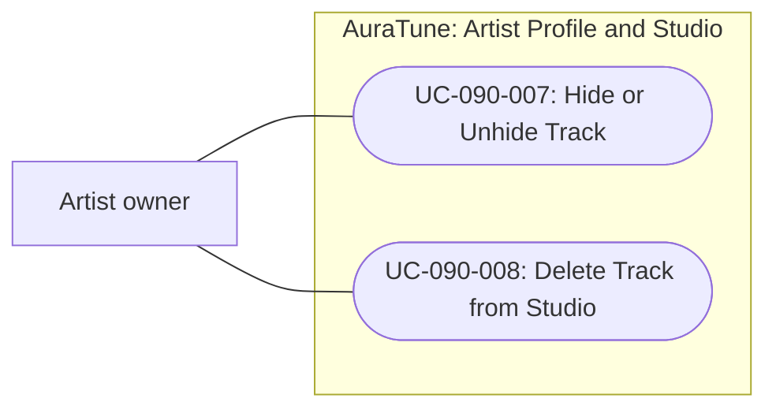
```mermaid
flowchart LR
 A2["Artist owner"]
 subgraph B["AuraTune: Artist Profile and Studio"]
 UUC090007(["UC-090-007: Hide or Unhide Track"])
 UUC090008(["UC-090-008: Delete Track from Studio"])
 end
 A2 --- UUC090007
 A2 --- UUC090008
```

### 100: AI Recommendations
Performed by: Group 10 Requirements Engineering Team | Reviewed by: Group 10 team | Edited by: Lê Công Minh Nhựt

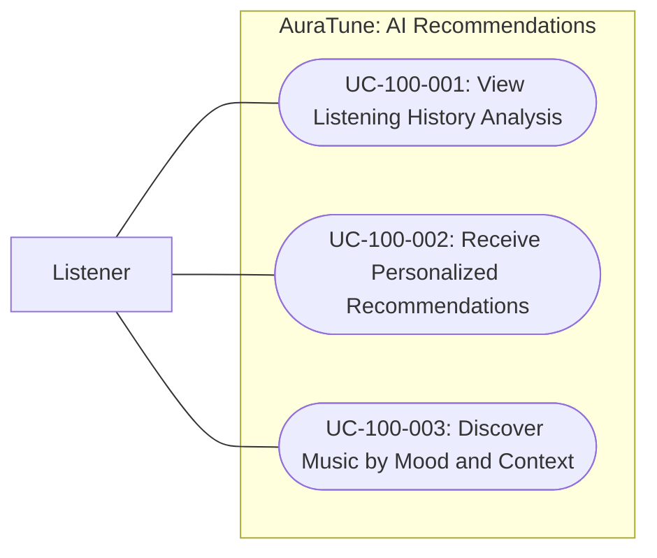
```mermaid
flowchart LR
 A0["Listener"]
 subgraph B["AuraTune: AI Recommendations"]
 UUC100001(["UC-100-001: View Listening History Analysis"])
 UUC100002(["UC-100-002: Receive Personalized Recommendations"])
 UUC100003(["UC-100-003: Discover Music by Mood and Context"])
 end
 A0 --- UUC100001
 A0 --- UUC100002
 A0 --- UUC100003
```

### 110: Admin Functions
Performed by: Group 10 Requirements Engineering Team | Reviewed by: Group 10 team | Edited by: Lê Công Minh Nhựt

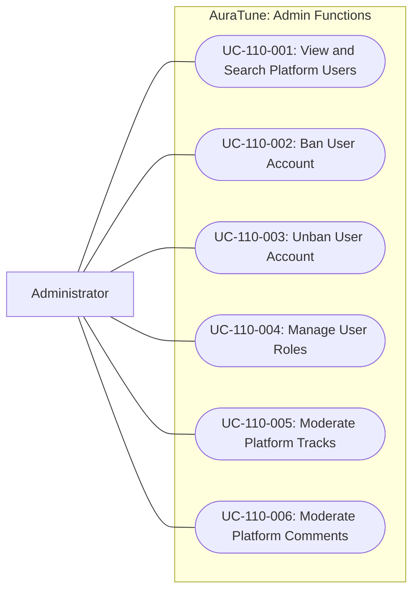
```mermaid
flowchart LR
 A0["Administrator"]
 subgraph B["AuraTune: Admin Functions"]
 UUC110001(["UC-110-001: View and Search Platform Users"])
 UUC110002(["UC-110-002: Ban User Account"])
 UUC110003(["UC-110-003: Unban User Account"])
 UUC110004(["UC-110-004: Manage User Roles"])
 UUC110005(["UC-110-005: Moderate Platform Tracks"])
 UUC110006(["UC-110-006: Moderate Platform Comments"])
 end
 A0 --- UUC110001
 A0 --- UUC110002
 A0 --- UUC110003
 A0 --- UUC110004
 A0 --- UUC110005
 A0 --- UUC110006
```

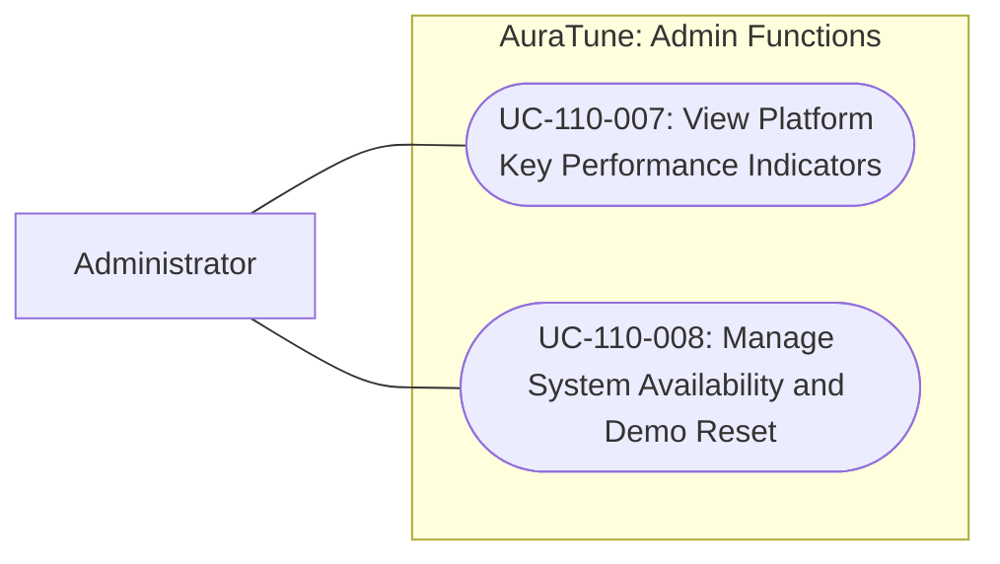
```mermaid
flowchart LR
 A0["Administrator"]
 subgraph B["AuraTune: Admin Functions"]
 UUC110007(["UC-110-007: View Platform Key Performance Indicators"])
 UUC110008(["UC-110-008: Manage System Availability and Demo Reset"])
 end
 A0 --- UUC110007
 A0 --- UUC110008
```

### 120: AI Conversational Agent
Performed by: Group 10 Requirements Engineering Team | Reviewed by: Group 10 team | Edited by: Lê Công Minh Nhựt

```mermaid
flowchart LR
 A0["Listener"]
 subgraph B["AuraTune: AI Conversational Agent"]
 UUC120001(["UC-120-001: Converse with AI Music Host"])
 UUC120002(["UC-120-002: Interpret Music Intent via Chat"])
 UUC120003(["UC-120-003: Execute Music Actions via Conversational Agent"])
 UUC120004(["UC-120-004: Clear Conversation History"])
 end
 A0 --- UUC120001
 A0 --- UUC120002
 A0 --- UUC120003
 A0 --- UUC120004
```

## 6. Relationships and workflow handoffs
Performed by: Group 10 Requirements Engineering Team | Reviewed by: Group 10 team | Edited by: Lê Công Minh Nhựt

| Relationship | Classification and condition |
| --- | --- |
| UC-120-001 to UC-120-002 | Required intent interpretation for ordinary submitted chat prompts. The existing included-use-case reference is scoped to that path; terminal clear/reset controls retain their own flows. |
| UC-070-001 to UC-040-001 | Conditional extension behavior after authenticated qualifying playback. Guest/short playback does not necessarily record an event. Threshold differences between source features remain registered. |
| UC-120-003 to Player, Queue or Library actions | The action type selects a destination. Queue addition is not mandatory for volume, pause or library actions; there is no unconditional include of UC-050-002. |
| UC-030-002/003 fallback to metadata | Alternative/exception paths within the search goals; not a global UML extend relation with a keyword-search base goal. |
| UC-050-007 to UC-060-002 then UC-060-003 | Queue export reuses playlist creation and may continue to details. This is a handoff, not an extension point inside every Create Playlist flow. |
| Recommendation, album, history or lyrics to Player | Playback/seek is a user-selected handoff, not an unconditional include of every browsing goal. |
| UC-040-010 from UC-040-008 | Optional authorized deletion while reading comments; it retains author/Admin checks. |

```mermaid
flowchart LR
 C["UC-120-001: ordinary chat prompt"] -. "include: required interpretation" .-> I["UC-120-002: Interpret Music Intent"]
 H["UC-070-001: Record Track Play Event"] -. "extend: signed-in qualifying play" .-> P["UC-040-001: Control Audio Playback"]
```

The arrows use Mermaid notation with labeled UML semantics. Include points from the base to reused required behavior; extend points from conditional behavior to the base. The qualifying-play guard does not resolve the separate threshold conflict.

## 7. Consolidated use-case catalog
Performed by: Group 10 Requirements Engineering Team | Reviewed by: Group 10 team | Edited by: Lê Công Minh Nhựt

Every entry below links to a specification file. FR references retain feature-qualified local numbering; they are not the Vision FR namespace. Feature 065 is an exception in source notation: the inventory alias `065-FR-001` corresponds to literal `FR-065-01`, through `065-FR-010` / `FR-065-10`. The normalization identifies the same requirements and does not rename source FRs. Original Writer and review metadata remain in the linked files. PA4 review is pending for this revision.

| UC ID | Name | Primary actor / beneficiary | Related FR references | Specification |
| --- | --- | --- | --- | --- |
| UC-010-001 | Register with Email | Visitor | `FR-011-001`, `FR-011-002`, `FR-011-003`, `FR-011-010` | [Specification](./use-cases/010-authentication/UC-010-001-register-with-email.md) |
| UC-010-002 | Login with Email | Visitor | `FR-011-004`, `FR-011-009`, `FR-013-009` | [Specification](./use-cases/010-authentication/UC-010-002-login-with-email.md) |
| UC-010-003 | Recover Password | Visitor | `FR-011-011` | [Specification](./use-cases/010-authentication/UC-010-003-recover-password.md) |
| UC-010-004 | Login with Google | Visitor | `FR-012-001`, `FR-012-003`, `FR-012-004`, `FR-012-007` | [Specification](./use-cases/010-authentication/UC-010-004-login-with-google.md) |
| UC-010-005 | Login with Facebook | Visitor | `FR-012-002`, `FR-012-003`, `FR-012-004`, `FR-012-007` | [Specification](./use-cases/010-authentication/UC-010-005-login-with-facebook.md) |
| UC-010-006 | Logout | Listener | `FR-013-006`, `FR-013-009` | [Specification](./use-cases/010-authentication/UC-010-006-logout.md) |
| UC-010-007 | View Active Sessions | Listener | `FR-013-007` | [Specification](./use-cases/010-authentication/UC-010-007-view-active-sessions.md) |
| UC-010-008 | Logout from All Devices | Listener | `FR-013-008` | [Specification](./use-cases/010-authentication/UC-010-008-logout-all-devices.md) |
| UC-010-009 | Unlink OAuth Provider | Listener | `FR-012-011` | [Specification](./use-cases/010-authentication/UC-010-009-unlink-oauth-provider.md) |
| UC-020-001 | Browse Home Dashboard | Guest / Visitor (`ACT-01`), Listener (`ACT-02`) | `021-FR-001`, `021-FR-002`, `021-FR-003`, `021-FR-004`, `021-FR-005`, `021-FR-006`, `021-FR-007`, `021-FR-008`, `021-FR-009`, `021-FR-010`, `021-FR-011`, `021-FR-012`, `021-FR-013` | [Specification](./use-cases/020-home-dashboard/UC-020-001-browse-home-dashboard.md) |
| UC-020-002 | Stream Recommended Music from Home | Listener (`ACT-02`), Guest / Visitor (`ACT-01`) | `022-FR-001`, `022-FR-002`, `022-FR-003`, `022-FR-004`, `022-FR-005`, `022-FR-006`, `022-FR-007`, `022-FR-008`, `022-FR-009`, `022-FR-010`, `022-FR-011`, `051-FR-013` | [Specification](./use-cases/020-home-dashboard/UC-020-002-stream-recommended-music-from-home.md) |
| UC-020-003 | Replay Recently Played Music | Listener (`ACT-02`) | `023-FR-001`, `023-FR-002`, `023-FR-003`, `023-FR-004`, `023-FR-005`, `023-FR-006`, `023-FR-007`, `023-FR-008`, `023-FR-009`, `023-FR-010`, `023-FR-011` | [Specification](./use-cases/020-home-dashboard/UC-020-003-replay-recently-played-music.md) |
| UC-020-004 | Browse Trending Charts | Guest / Visitor (`ACT-01`), Listener (`ACT-02`) | `024-FR-001`, `024-FR-002`, `024-FR-003`, `024-FR-004`, `024-FR-005`, `024-FR-006`, `024-FR-007`, `024-FR-008`, `024-FR-009`, `024-FR-010`, `024-FR-011`, `024-FR-012`, `024-FR-013`, `024-FR-014` | [Specification](./use-cases/020-home-dashboard/UC-020-004-browse-trending-charts.md) |
| UC-020-005 | Explore New Album Releases | Guest / Visitor (`ACT-01`), Listener (`ACT-02`) | `025-FR-001`, `025-FR-002`, `025-FR-003`, `025-FR-004`, `025-FR-005`, `025-FR-006`, `025-FR-007`, `025-FR-008`, `025-FR-009`, `025-FR-010`, `025-FR-011`, `051-FR-013` | [Specification](./use-cases/020-home-dashboard/UC-020-005-explore-new-album-releases.md) |
| UC-030-001 | Search by Metadata | Public User / Guest (`ACT-01`), Listener (`ACT-02`) | `031-FR-001` through `031-FR-019` | [Specification](./use-cases/030-search/UC-030-001-metadata-search.md) |
| UC-030-002 | AI Lyrics Search | Public User / Guest (`ACT-01`), Listener (`ACT-02`) | `032-FR-001` through `032-FR-019` | [Specification](./use-cases/030-search/UC-030-002-ai-lyrics-search.md) |
| UC-030-003 | Semantic Vector Music Search | Listener (`ACT-02`) | `033-FR-001` through `033-FR-017`, including `033-FR-003a`, `033-FR-004a`, and `033-FR-011a` | [Specification](./use-cases/030-search/UC-030-003-semantic-vector-search.md) |
| UC-030-004 | Manage Local Search History | Guest / Listener | 031-FR-019; FR-030-004 | [Specification](./use-cases/030-search/UC-030-004-manage-local-search-history.md) |
| UC-040-001 | Control Audio Playback | Guest / Visitor (`ACT-01`), Listener (`ACT-02`) | `041-FR-001`, `041-FR-002`, `041-FR-003`, `041-FR-004`, `041-FR-005`, `041-FR-006`, `041-FR-007`, `041-FR-008`, `041-FR-009`, `041-FR-010`, `041-FR-011`, `041-FR-012`, `041-FR-013`, `041-FR-014`, `041-FR-015` | [Specification](./use-cases/040-music-player/UC-040-001-control-audio-playback.md) |
| UC-040-002 | Adjust Volume and Mute | Guest / Visitor (`ACT-01`), Listener (`ACT-02`) | `042-FR-006`, `042-FR-007`, `042-FR-008`, `042-FR-009`, `042-FR-010`, `042-FR-011` | [Specification](./use-cases/040-music-player/UC-040-002-adjust-volume-and-mute.md) |
| UC-040-003 | Seek Audio Playback Position | Guest / Visitor (`ACT-01`), Listener (`ACT-02`) | `042-FR-001`, `042-FR-002`, `042-FR-003`, `042-FR-004`, `042-FR-005`, `042-FR-011`, `042-FR-012` | [Specification](./use-cases/040-music-player/UC-040-003-seek-audio-playback-position.md) |
| UC-040-004 | Toggle Shuffle and Repeat Modes | Guest / Visitor (`ACT-01`), Listener (`ACT-02`) | `043-FR-001`, `043-FR-002`, `043-FR-003`, `043-FR-004`, `043-FR-005`, `043-FR-006`, `043-FR-007`, `043-FR-008`, `043-FR-009`, `043-FR-010`, `043-FR-011`, `043-FR-012` | [Specification](./use-cases/040-music-player/UC-040-004-toggle-shuffle-and-repeat-modes.md) |
| UC-040-005 | View Synchronized Lyrics | Guest / Visitor (`ACT-01`), Listener (`ACT-02`) | `044-FR-001`, `044-FR-002`, `044-FR-003`, `044-FR-004`, `044-FR-005`, `044-FR-006`, `044-FR-007`, `044-FR-008`, `044-FR-009`, `044-FR-010`, `044-FR-011`, `044-FR-012` | [Specification](./use-cases/040-music-player/UC-040-005-view-synchronized-lyrics.md) |
| UC-040-006 | Toggle Persistent Mini and Full Player | Guest / Visitor (`ACT-01`), Listener (`ACT-02`) | `045-FR-001`, `045-FR-002`, `045-FR-003`, `045-FR-004`, `045-FR-005`, `045-FR-006`, `045-FR-007`, `045-FR-008`, `045-FR-009`, `045-FR-010`, `045-FR-011`, `045-FR-012` | [Specification](./use-cases/040-music-player/UC-040-006-toggle-persistent-mini-and-full-player.md) |
| UC-040-007 | Share Song | Guest / Visitor (`ACT-01`), Listener (`ACT-02`) | `046-FR-001`, `046-FR-002`, `046-FR-003`, `046-FR-004`, `046-FR-005` | [Specification](./use-cases/040-music-player/UC-040-007-share-song.md) |
| UC-040-008 | Read Track Comments | Guest / Visitor (`ACT-01`), Listener (`ACT-02`) | `046-FR-006`, `046-FR-007`, `046-FR-014`, `046-FR-015` | [Specification](./use-cases/040-music-player/UC-040-008-read-track-comments.md) |
| UC-040-009 | Post Track Comment | Listener (`ACT-02`) | `046-FR-008`, `046-FR-009`, `046-FR-012`, `046-FR-013`, `046-FR-015` | [Specification](./use-cases/040-music-player/UC-040-009-post-track-comment.md) |
| UC-040-010 | Delete Track Comment | Listener (`ACT-02`), Administrator (`ACT-05`) | `046-FR-010`, `046-FR-011`, `046-FR-012` | [Specification](./use-cases/040-music-player/UC-040-010-delete-track-comment.md) |
| UC-050-001 | View Playback Queue | Guest / Visitor (`ACT-01`), Listener (`ACT-02`) | `051-FR-001`, `051-FR-002`, `051-FR-003`, `051-FR-004`, `051-FR-005`, `051-FR-007`, `051-FR-008`, `051-FR-009`, `051-FR-010`, `051-FR-011`, `051-FR-013` | [Specification](./use-cases/050-queue-management/UC-050-001-view-playback-queue.md) |
| UC-050-002 | Add Track to Queue | Guest / Visitor (`ACT-01`), Listener (`ACT-02`) | `052-FR-001`, `052-FR-002`, `052-FR-003`, `052-FR-004`, `052-FR-005`, `052-FR-006`, `052-FR-007`, `052-FR-010`, `052-FR-011`, `052-FR-012`, `051-FR-013` | [Specification](./use-cases/050-queue-management/UC-050-002-add-track-to-queue.md) |
| UC-050-003 | Play Track Next | Guest / Visitor (`ACT-01`), Listener (`ACT-02`) | `054-FR-001`, `054-FR-002`, `054-FR-003`, `054-FR-004`, `054-FR-005`, `054-FR-006`, `054-FR-007`, `054-FR-008`, `054-FR-009`, `054-FR-010`, `052-FR-012`, `051-FR-013` | [Specification](./use-cases/050-queue-management/UC-050-003-play-track-next.md) |
| UC-050-004 | Reorder Upcoming Queue | Guest / Visitor (`ACT-01`), Listener (`ACT-02`) | `053-FR-001`, `053-FR-002`, `053-FR-003`, `053-FR-004`, `053-FR-005`, `053-FR-006`, `053-FR-007`, `053-FR-008`, `053-FR-009` | [Specification](./use-cases/050-queue-management/UC-050-004-reorder-upcoming-queue.md) |
| UC-050-005 | Remove Track from Queue | Guest / Visitor (`ACT-01`), Listener (`ACT-02`) | `052-FR-008`, `052-FR-009`, `052-FR-010`, `052-FR-011` | [Specification](./use-cases/050-queue-management/UC-050-005-remove-track-from-queue.md) |
| UC-050-006 | Clear Upcoming Queue | Guest / Visitor (`ACT-01`), Listener (`ACT-02`) | `051-FR-006`, `051-FR-007` | [Specification](./use-cases/050-queue-management/UC-050-006-clear-upcoming-queue.md) |
| UC-050-007 | Save Queue as Playlist | Listener (`ACT-02`) | `051-FR-012` | [Specification](./use-cases/050-queue-management/UC-050-007-save-queue-as-playlist.md) |
| UC-060-001 | View Playlists in Library | Listener | 061-FR-004, 061-FR-010, 062-FR-002 | [Specification](./use-cases/060-playlist-management/UC-060-001-view-playlists-in-library.md) |
| UC-060-002 | Create Playlist | Listener | 061-FR-001, 061-FR-002, 061-FR-003, 061-FR-009 | [Specification](./use-cases/060-playlist-management/UC-060-002-create-playlist.md) |
| UC-060-003 | View Playlist Details | Listener | 061-FR-005, 061-FR-006, 065-FR-010 | [Specification](./use-cases/060-playlist-management/UC-060-003-view-playlist-details.md) |
| UC-060-004 | Edit Playlist Metadata | Playlist Owner | 061-FR-007, 065-FR-006 | [Specification](./use-cases/060-playlist-management/UC-060-004-edit-playlist-metadata.md) |
| UC-060-005 | Delete Playlist | Playlist Owner | 061-FR-008, 065-FR-006 | [Specification](./use-cases/060-playlist-management/UC-060-005-delete-playlist.md) |
| UC-060-006 | Bookmark Public Playlist | Listener | 061-FR-010 | [Specification](./use-cases/060-playlist-management/UC-060-006-bookmark-public-playlist.md) |
| UC-060-007 | Add Songs to Playlist | Playlist Editor | 062-FR-001, 062-FR-003, 062-FR-006, 062-FR-007, 062-FR-008, 065-FR-004, 065-FR-008 | [Specification](./use-cases/060-playlist-management/UC-060-007-add-songs-to-playlist.md) |
| UC-060-008 | Remove Song from Playlist | Playlist Editor | 062-FR-005, 062-FR-006, 062-FR-007, 065-FR-004, 065-FR-008 | [Specification](./use-cases/060-playlist-management/UC-060-008-remove-song-from-playlist.md) |
| UC-060-009 | Reorder Songs in Playlist | Playlist Editor | 062-FR-003, 062-FR-004, 062-FR-007, 065-FR-004, 065-FR-008 | [Specification](./use-cases/060-playlist-management/UC-060-009-reorder-songs-in-playlist.md) |
| UC-060-010 | Toggle Like Song | Listener | 062-FR-002 | [Specification](./use-cases/060-playlist-management/UC-060-010-toggle-like-song.md) |
| UC-060-011 | Enable Collaboration on Playlist | Playlist Owner | 065-FR-001, 065-FR-009 | [Specification](./use-cases/060-playlist-management/UC-060-011-enable-collaboration-on-playlist.md) |
| UC-060-012 | Invite Collaborators | Playlist Owner | 065-FR-002, 065-FR-003, 065-FR-009 | [Specification](./use-cases/060-playlist-management/UC-060-012-invite-collaborators.md) |
| UC-060-013 | Manage Collaborators | Playlist Owner | 065-FR-007, 065-FR-009 | [Specification](./use-cases/060-playlist-management/UC-060-013-manage-collaborators.md) |
| UC-060-014 | View Collaborative Playlist Details | Participant | 065-FR-004, 065-FR-005, 065-FR-009, 065-FR-010 | [Specification](./use-cases/060-playlist-management/UC-060-014-view-collaborative-playlist-details.md) |
| UC-060-015 | Play Playlist | Listener | 063-FR-001 through 063-FR-009 | [Specification](./use-cases/060-playlist-management/UC-060-015-play-playlist.md) |
| UC-060-016 | Generate AI Playlist | Listener | 064-FR-001 through 064-FR-010 | [Specification](./use-cases/060-playlist-management/UC-060-016-generate-ai-playlist.md) |
| UC-070-001 | Record Track Play Event | System / Player | `071-FR-001`, `071-FR-002`, `071-FR-003`, `071-FR-010` | [Specification](./use-cases/070-listening-history/UC-070-001-record-track-play-event.md) |
| UC-070-002 | View Listening History | Listener | `071-FR-004`, `071-FR-005`, `071-FR-006`, `071-FR-007`, `071-FR-009`, `071-FR-011` | [Specification](./use-cases/070-listening-history/UC-070-002-view-listening-history.md) |
| UC-070-003 | Delete History Record | Listener | FR-070-003 (Vision); PA4-D04 | [Specification](./use-cases/070-listening-history/UC-070-003-delete-history-record.md) |
| UC-070-004 | Purge Entire History | Listener | `071-FR-008`, `071-FR-013` | [Specification](./use-cases/070-listening-history/UC-070-004-purge-entire-history.md) |
| UC-070-005 | View Duration Analytics | Listener | `072-FR-001` through `072-FR-008`, `071-FR-013` | [Specification](./use-cases/070-listening-history/UC-070-005-view-duration-analytics.md) |
| UC-070-006 | View Top Artists and Genres | Listener | `073-FR-001` through `073-FR-010`, `071-FR-013`, `072-FR-004` | [Specification](./use-cases/070-listening-history/UC-070-006-view-top-artists-and-genres.md) |
| UC-070-007 | Purge Expired History | System | `071-FR-012` | [Specification](./use-cases/070-listening-history/UC-070-007-purge-expired-history.md) |
| UC-080-001 | View Album Details | Listener (`ACT-02`), Guest/Visitor (`ACT-01`) | `081-FR-001` to `081-FR-016` | [Specification](./use-cases/080-album-interaction/UC-080-001-album-details.md) |
| UC-080-002 | Play Album Tracklist | Listener (`ACT-02`) | `082-FR-001` to `082-FR-016` | [Specification](./use-cases/080-album-interaction/UC-080-002-album-tracklist.md) |
| UC-080-003 | Save and Share Album | Listener (`ACT-02`) (Save), Guest/Visitor (`ACT-01`) (Share) | `083-FR-001` to `083-FR-014` | [Specification](./use-cases/080-album-interaction/UC-080-003-save-and-share-album.md) |
| UC-090-001 | View Public Artist Profile | Guest / Visitor; Listener (Artist and Administrator inherit public access in the model) | 091-FR-001, 002, 003, 004, 005, 006, 007, 008, 009, 010, 010A, 010B, 011, 012, 013, 014, 014A, 015, 016, 017, 018, 018A, 019, 020, 021, 022, 023, 024, 025, 026, 027; 092-FR-011 (public-profile consistency only) | [Specification](./use-cases/090-artist-profile-studio/UC-090-001-view-public-artist-profile.md) |
| UC-090-002 | Follow or Unfollow Artist | Listener; Artist; Administrator, acting only for their own authenticated, non-banned account | 092-FR-001, 092-FR-002, 092-FR-003, 092-FR-004, 092-FR-005, 092-FR-006, 092-FR-009, 092-FR-010, 092-FR-011, 092-FR-012, 092-FR-013, 092-FR-014, 092-FR-015, 092-FR-016 | [Specification](./use-cases/090-artist-profile-studio/UC-090-002-follow-or-unfollow-artist.md) |
| UC-090-003 | View Followed Artists | Listener; Artist; Administrator, accessing only their own authenticated, non-banned account's list | 092-FR-003, 092-FR-006, 092-FR-007, 092-FR-008, 092-FR-009, 092-FR-012, 092-FR-013, 092-FR-014, 092-FR-015, 092-FR-016; 091-FR-018/018A for public-profile handoff consistency only | [Specification](./use-cases/090-artist-profile-studio/UC-090-003-view-followed-artists.md) |
| UC-090-004 | Access Artist Studio Dashboard | Artist, accessing only their own Studio | 093-FR-001, 093-FR-002, 093-FR-003; 111-FR-011 (protected-access ban constraint); 112-FR-024/025 (restricted-owner viewing and moderation boundary) | [Specification](./use-cases/090-artist-profile-studio/UC-090-004-access-artist-studio-dashboard.md) |
| UC-090-005 | Upload Audio Track | Artist, uploading a new track for their own account | 093-FR-001, 093-FR-004, 093-FR-005, 093-FR-009, 093-FR-010; 111-FR-011 as a protected-access ban constraint | [Specification](./use-cases/090-artist-profile-studio/UC-090-005-upload-audio-track.md) |
| UC-090-006 | Edit Track Metadata | Artist, acting on their own uploaded track | 093-FR-001, 093-FR-005, 093-FR-006, 093-FR-009 | [Specification](./use-cases/090-artist-profile-studio/UC-090-006-edit-track-metadata.md) |
| UC-090-007 | Hide or Unhide Track | Artist, acting on their own track | 093-FR-001, 093-FR-007, 093-FR-009 | [Specification](./use-cases/090-artist-profile-studio/UC-090-007-hide-or-unhide-track.md) |
| UC-090-008 | Delete Track from Studio | Artist, acting on their own track | 093-FR-001, 093-FR-008, 093-FR-009 | [Specification](./use-cases/090-artist-profile-studio/UC-090-008-delete-track-from-studio.md) |
| UC-100-001 | View Listening History Analysis | Listener (`ACT-02`) | `101-FR-001`, `101-FR-002`, `101-FR-003`, `101-FR-004`, `101-FR-005`, `101-FR-006`, `101-FR-007`, `101-FR-008`, `101-FR-009`, `101-FR-010`, `101-FR-011`, `101-FR-012`, `101-FR-013`, `101-FR-014` | [Specification](./use-cases/100-ai-recommendations/UC-100-001-view-listening-history-analysis.md) |
| UC-100-002 | Receive Personalized Recommendations | Listener (`ACT-02`) | `102-FR-001`, `102-FR-002`, `102-FR-003`, `102-FR-004`, `102-FR-005`, `102-FR-006`, `102-FR-007`, `102-FR-008`, `102-FR-009`, `102-FR-010`, `102-FR-011`, `102-FR-012`, `102-FR-013`, `102-FR-014`, `102-FR-015` | [Specification](./use-cases/100-ai-recommendations/UC-100-002-receive-personalized-recommendations.md) |
| UC-100-003 | Discover Music by Mood and Context | Listener (`ACT-02`) | `103-FR-001`, `103-FR-002`, `103-FR-003`, `103-FR-004`, `103-FR-005`, `103-FR-006`, `103-FR-007`, `103-FR-008`, `103-FR-009`, `103-FR-010`, `103-FR-011`, `103-FR-012`, `103-FR-013`, `103-FR-014`, `103-FR-015` | [Specification](./use-cases/100-ai-recommendations/UC-100-003-discover-music-by-mood-and-context.md) |
| UC-110-001 | View and Search Platform Users | Administrator | 111-FR-001..004, 007..009, 012..015, 017, 021; FR-110-001 | [Specification](./use-cases/110-admin-functions/UC-110-001-view-and-search-users.md) |
| UC-110-002 | Ban User Account | Administrator | 111-FR-005, 007..013, 015..017, 020, 023; FR-110-002 | [Specification](./use-cases/110-admin-functions/UC-110-002-ban-user-account.md) |
| UC-110-003 | Unban User Account | Administrator | 111-FR-006..009, 012..017, 023; FR-110-003 | [Specification](./use-cases/110-admin-functions/UC-110-003-unban-user-account.md) |
| UC-110-004 | Manage User Roles | Administrator | 111-FR-007..009, 012..015, 017, 022; FR-110-004 | [Specification](./use-cases/110-admin-functions/UC-110-004-manage-user-roles.md) |
| UC-110-005 | Moderate Platform Tracks | Administrator | 112-FR-001..030; FR-110-005 | [Specification](./use-cases/110-admin-functions/UC-110-005-moderate-platform-tracks.md) |
| UC-110-006 | Moderate Platform Comments | Administrator | FR-110-006; related UC-040-010 | [Specification](./use-cases/110-admin-functions/UC-110-006-moderate-platform-comments.md) |
| UC-110-007 | View Platform Key Performance Indicators | Administrator | 113-FR-001..019; FR-110-007 | [Specification](./use-cases/110-admin-functions/UC-110-007-view-platform-statistics.md) |
| UC-110-008 | Manage System Availability and Demo Reset | Administrator | FR-110-008; Vision goal beyond the read-only 113 scope | [Specification](./use-cases/110-admin-functions/UC-110-008-manage-system-and-demo-reset.md) |
| UC-120-001 | Converse with AI Music Host | Listener (`ACT-02`) | `121-FR-001`, `121-FR-002`, `121-FR-003`, `121-FR-004`, `121-FR-005`, `121-FR-006`, `121-FR-007`, `121-FR-008`, `121-FR-009`, `121-FR-010`, `121-FR-011`, `121-FR-012` | [Specification](./use-cases/120-ai-conversational-agent/UC-120-001-converse-with-ai-music-host.md) |
| UC-120-002 | Interpret Music Intent via Chat | Listener (`ACT-02`) | `122-FR-001`, `122-FR-002`, `122-FR-003`, `122-FR-004`, `122-FR-005`, `122-FR-006`, `122-FR-007`, `122-FR-008`, `122-FR-009`, `122-FR-010`, `122-FR-011`, `122-FR-012` | [Specification](./use-cases/120-ai-conversational-agent/UC-120-002-interpret-music-intent-via-chat.md) |
| UC-120-003 | Execute Music Actions via Conversational Agent | Listener (`ACT-02`) | `123-FR-001`, `123-FR-002`, `123-FR-003`, `123-FR-004`, `123-FR-005`, `123-FR-006`, `123-FR-007`, `123-FR-008`, `123-FR-009`, `123-FR-010`, `123-FR-011`, `123-FR-012`, `123-FR-013`, `123-FR-014` | [Specification](./use-cases/120-ai-conversational-agent/UC-120-003-execute-music-actions-via-conversational-agent.md) |
| UC-120-004 | Clear Conversation History | Listener (`ACT-02`) | `121-FR-003`, `121-FR-008` | [Specification](./use-cases/120-ai-conversational-agent/UC-120-004-clear-conversation-history.md) |

## 8. Implementation and source limitations
Performed by: Group 10 Requirements Engineering Team | Reviewed by: Group 10 team | Edited by: Lê Công Minh Nhựt

The source/implementation register identifies browser-only history/comments/Admin actions, process-memory album saves, incomplete Studio mutations and AI fallback/static-candidate behavior. Full end-to-end acceptance is not inferred from UI screenshots or checked Spec Kit tasks. [source review](#11-pa4-decisions-and-source-review) also retains source decisions that require an authorized update to the unchanged Vision/specs.

## 9. Vision FR and historical UC crosswalk
Performed by: Group 10 Requirements Engineering Team | Reviewed by: Group 10 team | Edited by: Lê Công Minh Nhựt

This crosswalk maps goals, not equal-looking numbers. The owner chose existing file IDs on 2026-11-20. Historical references below are explicitly labeled and do not identify different current goals by accident.

| Vision FR | Historical Vision UC | Current specification(s) | Alignment note |
| --- | --- | --- | --- |
| FR-010-001 | UC-010-001 (historical) | [UC-010-001](use-cases/010-authentication/UC-010-001-register-with-email.md) | Same goal identifier; detailed/source constraints still apply. |
| FR-010-002 | UC-010-002 (historical) | [UC-010-002](use-cases/010-authentication/UC-010-002-login-with-email.md) | Same goal identifier; detailed/source constraints still apply. |
| FR-010-003 | UC-010-003 (historical) | [UC-010-004](use-cases/010-authentication/UC-010-004-login-with-google.md) | Historical ID translated by goal; no existing UC file renamed. |
| FR-010-004 | UC-010-004 (historical) | [UC-010-005](use-cases/010-authentication/UC-010-005-login-with-facebook.md) | Historical ID translated by goal; no existing UC file renamed. |
| FR-010-005 | UC-010-005 (historical) | [UC-010-002](use-cases/010-authentication/UC-010-002-login-with-email.md) | Automatic refresh is supporting behavior of authenticated sessions; View Active Sessions remains current UC-010-007. |
| FR-010-006 | UC-010-006 (historical) | [UC-010-003](use-cases/010-authentication/UC-010-003-recover-password.md) | Historical ID translated by goal; no existing UC file renamed. |
| FR-010-007 | UC-010-007 (historical) | [UC-010-006](use-cases/010-authentication/UC-010-006-logout.md) | Historical ID translated by goal; no existing UC file renamed. |
| FR-010-008 | UC-010-008 (historical) | [UC-010-008](use-cases/010-authentication/UC-010-008-logout-all-devices.md) | Same goal identifier; detailed/source constraints still apply. |
| FR-010-009 | UC-010-009 (historical) | [UC-010-009](use-cases/010-authentication/UC-010-009-unlink-oauth-provider.md) | Same goal identifier; detailed/source constraints still apply. |
| FR-020-001 | UC-020-001 (historical) | [UC-020-001](use-cases/020-home-dashboard/UC-020-001-browse-home-dashboard.md) | Same goal identifier; detailed/source constraints still apply. |
| FR-020-002 | UC-020-002 (historical) | [UC-020-002](use-cases/020-home-dashboard/UC-020-002-stream-recommended-music-from-home.md) | Same goal identifier; detailed/source constraints still apply. |
| FR-020-003 | UC-020-003 (historical) | [UC-020-003](use-cases/020-home-dashboard/UC-020-003-replay-recently-played-music.md) | Same goal identifier; detailed/source constraints still apply. |
| FR-020-004 | UC-020-004 (historical) | [UC-020-004](use-cases/020-home-dashboard/UC-020-004-browse-trending-charts.md) | Same goal identifier; detailed/source constraints still apply. |
| FR-020-005 | UC-020-005 (historical) | [UC-020-005](use-cases/020-home-dashboard/UC-020-005-explore-new-album-releases.md) | Same goal identifier; detailed/source constraints still apply. |
| FR-030-001 | UC-030-001 (historical) | [UC-030-001](use-cases/030-search/UC-030-001-metadata-search.md) | Same goal identifier; detailed/source constraints still apply. |
| FR-030-002 | UC-030-002 (historical) | [UC-030-002](use-cases/030-search/UC-030-002-ai-lyrics-search.md) | Same goal identifier; detailed/source constraints still apply. |
| FR-030-003 | UC-030-003 (historical) | [UC-030-003](use-cases/030-search/UC-030-003-semantic-vector-search.md) | PA4-D05 adopts Listener-only access from spec 033; Vision actor wording needs source alignment. |
| FR-030-004 | UC-030-004 (historical) | [UC-030-004](use-cases/030-search/UC-030-004-manage-local-search-history.md) | Same goal identifier; detailed/source constraints still apply. |
| FR-040-001 | UC-040-001 (historical) | [UC-040-001](use-cases/040-music-player/UC-040-001-control-audio-playback.md) | Same goal identifier; detailed/source constraints still apply. |
| FR-040-002 | UC-040-002 (historical) | [UC-040-002](use-cases/040-music-player/UC-040-002-adjust-volume-and-mute.md) | Same goal identifier; detailed/source constraints still apply. |
| FR-040-003 | UC-040-003 (historical) | [UC-040-003](use-cases/040-music-player/UC-040-003-seek-audio-playback-position.md) | Same goal identifier; detailed/source constraints still apply. |
| FR-040-004 | UC-040-004 (historical) | [UC-040-004](use-cases/040-music-player/UC-040-004-toggle-shuffle-and-repeat-modes.md) | Same goal identifier; detailed/source constraints still apply. |
| FR-040-005 | UC-040-005 (historical) | [UC-040-005](use-cases/040-music-player/UC-040-005-view-synchronized-lyrics.md) | Same goal identifier; detailed/source constraints still apply. |
| FR-040-006 | UC-040-006 (historical) | [UC-040-006](use-cases/040-music-player/UC-040-006-toggle-persistent-mini-and-full-player.md) | Same goal identifier; detailed/source constraints still apply. |
| FR-040-007 | UC-040-007 (historical) | [UC-040-007](use-cases/040-music-player/UC-040-007-share-song.md) | Same goal identifier; detailed/source constraints still apply. |
| FR-040-008 | UC-040-008 (historical) | [UC-040-008](use-cases/040-music-player/UC-040-008-read-track-comments.md) | Same goal identifier; detailed/source constraints still apply. |
| FR-040-009 | UC-040-009 (historical) | [UC-040-009](use-cases/040-music-player/UC-040-009-post-track-comment.md) | Same goal identifier; detailed/source constraints still apply. |
| FR-040-010 | UC-040-010 (historical) | [UC-040-010](use-cases/040-music-player/UC-040-010-delete-track-comment.md) | Same goal identifier; detailed/source constraints still apply. |
| FR-050-001 | UC-050-001 (historical) | [UC-050-001](use-cases/050-queue-management/UC-050-001-view-playback-queue.md) | Same goal identifier; detailed/source constraints still apply. |
| FR-050-002 | UC-050-002 (historical) | [UC-050-002](use-cases/050-queue-management/UC-050-002-add-track-to-queue.md) | Same goal identifier; detailed/source constraints still apply. |
| FR-050-003 | UC-050-003 (historical) | [UC-050-003](use-cases/050-queue-management/UC-050-003-play-track-next.md) | Same goal identifier; detailed/source constraints still apply. |
| FR-050-004 | UC-050-004 (historical) | [UC-050-004](use-cases/050-queue-management/UC-050-004-reorder-upcoming-queue.md) | Same goal identifier; detailed/source constraints still apply. |
| FR-050-005 | UC-050-005 (historical) | [UC-050-005](use-cases/050-queue-management/UC-050-005-remove-track-from-queue.md) | Same goal identifier; detailed/source constraints still apply. |
| FR-050-006 | UC-050-006 (historical) | [UC-050-006](use-cases/050-queue-management/UC-050-006-clear-upcoming-queue.md) | Same goal identifier; detailed/source constraints still apply. |
| FR-050-007 | UC-050-007 (historical) | [UC-050-007](use-cases/050-queue-management/UC-050-007-save-queue-as-playlist.md) | Same goal identifier; detailed/source constraints still apply. |
| FR-060-001 | UC-060-001 (historical) | [UC-060-002](use-cases/060-playlist-management/UC-060-002-create-playlist.md) | Historical ID translated by goal; no existing UC file renamed. |
| FR-060-002 | UC-060-002 (historical) | [UC-060-003](use-cases/060-playlist-management/UC-060-003-view-playlist-details.md) | Historical ID translated by goal; no existing UC file renamed. |
| FR-060-003 | UC-060-003 (historical) | [UC-060-004](use-cases/060-playlist-management/UC-060-004-edit-playlist-metadata.md) | Historical ID translated by goal; no existing UC file renamed. |
| FR-060-004 | UC-060-004 (historical) | [UC-060-005](use-cases/060-playlist-management/UC-060-005-delete-playlist.md) | Historical ID translated by goal; no existing UC file renamed. |
| FR-060-005 | UC-060-005 (historical) | [UC-060-007](use-cases/060-playlist-management/UC-060-007-add-songs-to-playlist.md) | Historical ID translated by goal; no existing UC file renamed. |
| FR-060-006 | UC-060-006 (historical) | [UC-060-008](use-cases/060-playlist-management/UC-060-008-remove-song-from-playlist.md) | Historical ID translated by goal; no existing UC file renamed. |
| FR-060-007 | UC-060-007 (historical) | [UC-060-009](use-cases/060-playlist-management/UC-060-009-reorder-songs-in-playlist.md) | Historical ID translated by goal; no existing UC file renamed. |
| FR-060-008 | UC-060-008 (historical) | [UC-060-015](use-cases/060-playlist-management/UC-060-015-play-playlist.md) | Historical ID translated by goal; no existing UC file renamed. |
| FR-060-009 | UC-060-009 (historical) | [UC-060-010](use-cases/060-playlist-management/UC-060-010-toggle-like-song.md) | Historical ID translated by goal; no existing UC file renamed. |
| FR-060-010 | UC-060-010 (historical) | [UC-060-016](use-cases/060-playlist-management/UC-060-016-generate-ai-playlist.md) | Historical ID translated by goal; no existing UC file renamed. |
| FR-060-011 | UC-060-011 (historical) | [UC-060-011](use-cases/060-playlist-management/UC-060-011-enable-collaboration-on-playlist.md), [UC-060-012](use-cases/060-playlist-management/UC-060-012-invite-collaborators.md), [UC-060-013](use-cases/060-playlist-management/UC-060-013-manage-collaborators.md), [UC-060-014](use-cases/060-playlist-management/UC-060-014-view-collaborative-playlist-details.md) | Historical ID translated by goal; no existing UC file renamed. |
| FR-060-012 | UC-060-012 (historical) | [UC-060-006](use-cases/060-playlist-management/UC-060-006-bookmark-public-playlist.md) | Historical ID translated by goal; no existing UC file renamed. |
| FR-070-001 | UC-070-001 (historical) | [UC-070-001](use-cases/070-listening-history/UC-070-001-record-track-play-event.md) | Same goal identifier; detailed/source constraints still apply. |
| FR-070-002 | UC-070-002 (historical) | [UC-070-002](use-cases/070-listening-history/UC-070-002-view-listening-history.md) | Same goal identifier; detailed/source constraints still apply. |
| FR-070-003 | UC-070-003 (historical) | [UC-070-003](use-cases/070-listening-history/UC-070-003-delete-history-record.md) | Same goal identifier; detailed/source constraints still apply. |
| FR-070-004 | UC-070-004 (historical) | [UC-070-004](use-cases/070-listening-history/UC-070-004-purge-entire-history.md) | Same goal identifier; detailed/source constraints still apply. |
| FR-070-005 | UC-070-005 (historical) | [UC-070-005](use-cases/070-listening-history/UC-070-005-view-duration-analytics.md) | Same goal identifier; detailed/source constraints still apply. |
| FR-070-006 | UC-070-006 (historical) | [UC-070-006](use-cases/070-listening-history/UC-070-006-view-top-artists-and-genres.md) | Same goal identifier; detailed/source constraints still apply. |
| FR-080-001 | UC-080-001 (historical) | [UC-080-001](use-cases/080-album-interaction/UC-080-001-album-details.md) | Same goal identifier; detailed/source constraints still apply. |
| FR-080-002 | UC-080-002 (historical) | [UC-080-002](use-cases/080-album-interaction/UC-080-002-album-tracklist.md) | PA4-D03 preserves unrelated queued tracks after the album; implementation/spec alignment pending. |
| FR-080-003 | UC-080-003 (historical) | [UC-080-002](use-cases/080-album-interaction/UC-080-002-album-tracklist.md) | Historical ID translated by goal; no existing UC file renamed. |
| FR-080-004 | UC-080-004 (historical) | [UC-080-003](use-cases/080-album-interaction/UC-080-003-save-and-share-album.md) | Historical ID translated by goal; no existing UC file renamed. |
| FR-080-005 | UC-080-005 (historical) | [UC-080-003](use-cases/080-album-interaction/UC-080-003-save-and-share-album.md) | Historical ID translated by goal; no existing UC file renamed. |
| FR-090-001 | UC-090-001 (historical) | [UC-090-001](use-cases/090-artist-profile-studio/UC-090-001-view-public-artist-profile.md) | Preserve G090-D01-D18 source boundaries; broader Vision scope is not automatically fulfilled. |
| FR-090-002 | UC-090-002 (historical) | [UC-090-002](use-cases/090-artist-profile-studio/UC-090-002-follow-or-unfollow-artist.md) | Preserve G090-D01-D18 source boundaries; broader Vision scope is not automatically fulfilled. |
| FR-090-003 | UC-090-003 (historical) | [UC-090-003](use-cases/090-artist-profile-studio/UC-090-003-view-followed-artists.md) | Preserve G090-D01-D18 source boundaries; broader Vision scope is not automatically fulfilled. |
| FR-090-004 | UC-090-004 (historical) | [UC-090-004](use-cases/090-artist-profile-studio/UC-090-004-access-artist-studio-dashboard.md) | Preserve G090-D01-D18 source boundaries; broader Vision scope is not automatically fulfilled. |
| FR-090-005 | UC-090-005 (historical) | [UC-090-005](use-cases/090-artist-profile-studio/UC-090-005-upload-audio-track.md) | Preserve G090-D01-D18 source boundaries; broader Vision scope is not automatically fulfilled. |
| FR-090-006 | UC-090-006 (historical) | [UC-090-006](use-cases/090-artist-profile-studio/UC-090-006-edit-track-metadata.md) | Preserve G090-D01-D18 source boundaries; broader Vision scope is not automatically fulfilled. |
| FR-090-007 | UC-090-007 (historical) | [UC-090-007](use-cases/090-artist-profile-studio/UC-090-007-hide-or-unhide-track.md) | Preserve G090-D01-D18 source boundaries; broader Vision scope is not automatically fulfilled. |
| FR-090-008 | UC-090-008 (historical) | [UC-090-008](use-cases/090-artist-profile-studio/UC-090-008-delete-track-from-studio.md) | Preserve G090-D01-D18 source boundaries; broader Vision scope is not automatically fulfilled. |
| FR-100-001 | UC-100-001 (historical) | [UC-100-001](use-cases/100-ai-recommendations/UC-100-001-view-listening-history-analysis.md) | Vision embedding/likes/skip-profile wording exceeds Feature 101 history-only statistics; source alignment pending. |
| FR-100-002 | UC-100-002 (historical) | [UC-100-002](use-cases/100-ai-recommendations/UC-100-002-receive-personalized-recommendations.md) | Same goal identifier; detailed/source constraints still apply. |
| FR-100-003 | UC-100-003 (historical) | [UC-100-003](use-cases/100-ai-recommendations/UC-100-003-discover-music-by-mood-and-context.md) | Same goal identifier; detailed/source constraints still apply. |
| FR-110-001 | UC-110-001 (historical) | [UC-110-001](use-cases/110-admin-functions/UC-110-001-view-and-search-users.md) | New drafts retain owner-selected newer rules and explicitly identify source/prototype/implementation gaps. |
| FR-110-002 | UC-110-002 (historical) | [UC-110-002](use-cases/110-admin-functions/UC-110-002-ban-user-account.md) | New drafts retain owner-selected newer rules and explicitly identify source/prototype/implementation gaps. |
| FR-110-003 | UC-110-003 (historical) | [UC-110-003](use-cases/110-admin-functions/UC-110-003-unban-user-account.md) | New drafts retain owner-selected newer rules and explicitly identify source/prototype/implementation gaps. |
| FR-110-004 | UC-110-004 (historical) | [UC-110-004](use-cases/110-admin-functions/UC-110-004-manage-user-roles.md) | New drafts retain owner-selected newer rules and explicitly identify source/prototype/implementation gaps. |
| FR-110-005 | UC-110-005 (historical) | [UC-110-005](use-cases/110-admin-functions/UC-110-005-moderate-platform-tracks.md) | New drafts retain owner-selected newer rules and explicitly identify source/prototype/implementation gaps. |
| FR-110-006 | UC-110-006 (historical) | [UC-110-006](use-cases/110-admin-functions/UC-110-006-moderate-platform-comments.md) | New drafts retain owner-selected newer rules and explicitly identify source/prototype/implementation gaps. |
| FR-110-007 | UC-110-007 (historical) | [UC-110-007](use-cases/110-admin-functions/UC-110-007-view-platform-statistics.md) | New drafts retain owner-selected newer rules and explicitly identify source/prototype/implementation gaps. |
| FR-110-008 | UC-110-008 (historical) | [UC-110-008](use-cases/110-admin-functions/UC-110-008-manage-system-and-demo-reset.md) | New drafts retain owner-selected newer rules and explicitly identify source/prototype/implementation gaps. |
| FR-120-001 | UC-120-001 (historical) | [UC-120-001](use-cases/120-ai-conversational-agent/UC-120-001-converse-with-ai-music-host.md) | Same goal identifier; detailed/source constraints still apply. |
| FR-120-002 | UC-120-002 (historical) | [UC-120-002](use-cases/120-ai-conversational-agent/UC-120-002-interpret-music-intent-via-chat.md) | Same goal identifier; detailed/source constraints still apply. |
| FR-120-003 | UC-120-003 (historical) | [UC-120-003](use-cases/120-ai-conversational-agent/UC-120-003-execute-music-actions-via-conversational-agent.md) | Same goal identifier; detailed/source constraints still apply. |
| FR-120-004 | UC-120-004 (historical) | [UC-120-004](use-cases/120-ai-conversational-agent/UC-120-004-clear-conversation-history.md) | Same goal identifier; detailed/source constraints still apply. |

## 10. Source references and review status
Performed by: Group 10 Requirements Engineering Team | Reviewed by: Group 10 team | Edited by: Lê Công Minh Nhựt

- [Vision Document](../proposal/Auratune_Vision_Document.md): requirements and original crosswalk IDs.
- [Project Plan](../proposal/project_plan.md): PA4 deliverables D-21/D-22.
- [Use-case authoring guide](./use-cases/README.md): structure and source/conflict rules.
- [API contract](../analysis-and-design/api-contract.md): shared interface/access boundaries; source discrepancies remain explicit.
- [PA4 review register](#11-pa4-decisions-and-source-review): owner decisions, evidence and unresolved work.
- [PA4 change log](../Changes.md): one section per revised document.

The PA3 baseline is confirmed by the owner. Independent peer review, missing prototype states and unresolved product details remain open. This model does not mark those items approved.

## 11. PA4 decisions and source review
Performed by: Group 10 Requirements Engineering Team | Reviewed by: Group 10 team | Edited by: Lê Công Minh Nhựt

### 1. Sources and comparison baseline
Performed by: Group 10 Requirements Engineering Team | Reviewed by: Group 10 team | Edited by: Lê Công Minh Nhựt

Assignment: `docs/PA/PA4-2026.pdf`, Part A and Submission Guidelines. Owner instruction on 2026-11-20: TA supplied no feedback; elaborate the current documents. Therefore all changes in this revision are team/owner-requested corrections and elaborations, not claimed TA findings.

Confirmed PA3 baseline: the original documents before this PA4 revision, as confirmed by the owner in PA4-D07. The recorded pre-edit checkout is `35d8027`; its latest requirements history entry is `8ec2d25c11a7a2d2ac663c9ab751c53f0dbbdb7b` (2026-11-06, message `testt`). The revision manifest records the original document hashes, and the per-document diffs compare this baseline with the PA4 revision. This identification relies on the owner's confirmation, not the commit date alone. Original PA3 Changes.md files are preserved.

The original 74 UC specification files and their IDs are preserved; ten missing model/Vision goals are added as drafts, making 84 files. All source files under specs/ and application code remain unchanged by this revision.

### 2. Owner decisions recorded in this session
Performed by: Group 10 Requirements Engineering Team | Reviewed by: Group 10 team | Edited by: Lê Công Minh Nhựt

| ID | Decision on 2026-11-20 | Scope |
| --- | --- | --- |
| PA4-D01 | TA supplied no feedback; add detail to the current version. | No fabricated TA findings or approvals. |
| PA4-D02 | Keep existing UC file IDs and add a historical-ID crosswalk. | Model, catalog and references; no file renumbering. |
| PA4-D03 | Play Album keeps unrelated queued tracks behind the album, following clarification and FR-012. | UC-080-002; source FR-004 and App.jsx alignment remain separate. |
| PA4-D04 | Retain individual history deletion according to the Vision. | Missing UC-070-003 is drafted; deletion mechanics and effects need detail. |
| PA4-D05 | Semantic-search access follows Feature 033. | Listener-only; do not silently broaden to Guest. |
| PA4-D06 | Administration follows newer rules where old/new source statements differ. | Direct actions/default ban reason; newer removal policy with retained history. Unrelated unresolved details remain open. |
| PA4-D07 | The original documents before this PA4 revision are the PA3 baseline. | Owner-confirmed baseline: pre-edit snapshot at `35d8027` and the original document hashes in the revision manifest. |
| PA4-D08 | Report attribution: performed and edited by Lê Công Minh Nhựt; reviewed by the Group 10 team. | Owner-specified responsibility for this PA4 revision. Review assignment does not by itself establish final approval or close unresolved acceptance items. |
| PA4-D09 | Restore Performed by to the PA3 responsible author; preserve the current Reviewed by and Edited by values. | Group 010 uses Mai Đăng Khoa as explicitly confirmed by the owner; other group credits follow PA3 group responsibility. Current review remains the Group 10 team and editing remains Lê Công Minh Nhựt. |

These are the current user's decisions. They do not assert a named teammate's identity, TA review or independent peer approval.

### 3. Source conflicts and remaining decisions
Performed by: Group 10 Requirements Engineering Team | Reviewed by: Group 10 team | Edited by: Lê Công Minh Nhựt

| ID | Source difference | Disposition |
| --- | --- | --- |
| S01 | Model/Vision IDs differ from existing 010/060/080 specifications. | PA4-D02 resolves current document numbering. Model Section 9 preserves the historical mapping. Vision is unchanged. |
| S02 | Album replacement FR-004 differs from clarification/FR-012 preservation. | PA4-D03 resolves UC behavior. Spec/task/code edits are outside this task and still needed. |
| S03 | Vision individual-history deletion has no Feature 071 operation definition. | PA4-D04 retains the goal. Confirmation, duplicate/missing handling, physical deletion and aggregate/AI effects still need review. |
| S04 | Vision permits Guest semantic search; Feature 033 requires Listener. | PA4-D05 selects the spec access boundary; Vision source alignment remains pending. |
| S05 | Admin mandatory custom reason versus newer default-reason direct action. | PA4-D06 selects newer behavior. Do not claim a manually entered reason exists when the default was used. |
| S06 | Older Admin permanent-delete/started-playback wording differs from newer removal/blocking/preserved-history wording. | PA4-D06 selects newer policy; exact physical media deletion and remaining lifecycle interpretation are not invented. |
| S07 | Vision/Player/History have different qualifying-play thresholds, including half-track and short-track completion wording. | Pending source decision; removed unconditional history include and the model's unsupported universal 50% claim. Do not silently change feature requirements. |
| S08 | Vision G09 includes MP3/FLAC, broader metadata, live follower counts and album organization; Group 090 decisions narrow/defer parts. | Preserve G090-D01-D18 and accepted feature boundaries. Those do not prove full Vision coverage. Source alignment and broader scope remain pending. |
| S09 | Vision FR-100-001 calls for an embedding/likes/skip-based taste profile, while Feature 101 FR-003 uses history only. | Current UC describes history-only statistics. External AI supporting actor removed for this goal. Broader Vision alignment remains pending. |
| S10 | Vision lists active-session and AI-latency Admin metrics; 113 uses four metrics and earlier text describes two. | PA4-D06 adopts newer four-metric scope; unsupported extra metrics are not fabricated. Metric-source acceptance remains pending. |
| S11 | Vision AI toggle/demo reset exceeds read-only Feature 113 and lacks reset safety/data scope. | UC-110-008 is a Draft with explicit unresolved scope; no reset executed or endpoint invented. |
| S12 | Album playback Guest access differs between Vision and Listener-only feature/UC wording. | Pending product alignment. Public album viewing/sharing does not establish Guest playback permission. |
| S14 | Vision FR-110-005 permits broad Admin metadata editing, while 112-FR-008 explicitly prohibits it. | Pending source decision; track moderation drafts do not grant metadata editing. |
| S13 | UC-110-006 comment-moderation goal exists in Vision/UC-040-010 but is outside track-focused 112. | Added a Vision-backed Draft with entry point, contract and prototype still pending. |

### 4. Implementation evidence by group
Performed by: Group 10 Requirements Engineering Team | Reviewed by: Group 10 team | Edited by: Lê Công Minh Nhựt

Source inspection was performed on the current checkout; no new live acceptance execution is claimed.

| Group | Observed source and limits |
| --- | --- |
| 010 Authentication | Authentication routes and repositories exist in `src/backend/routes/authRoutes.js` and `src/backend/repositories/authRepository.js`. Firebase exchange is also present. Validate the actual login/recovery/session route and authoritative account state; frontend navigation alone is insufficient. The integrated backend entrypoint currently has a duplicate import. Automatic refresh is supporting session behavior, not a replacement for the existing View Active Sessions goal. |
| 020 Home Dashboard | `HomePage.jsx`, `ChartsPage.jsx` and `ExplorePage.jsx` provide the presentation. Some catalog/ranking inputs still use `src/frontend/src/utils/mockData.js`. Live recommendation widgets do not establish that every Home section is backed by an authoritative catalog or calculated platform ranking. |
| 030 Search | `src/frontend/src/pages/Search/SearchPage.jsx` calls `utils/searchEngine.js`, which uses local catalog matching and mock recommendations. The required backend metadata/lyrics/vector search behavior is not established by that UI. Search history and live semantic results need separate acceptance evidence. |
| 040 Music Player | Player components and `useAudioPlayer.js` exist, with backend metadata/stream handling in `songController.js`. Comments remain browser-state operations in `AppStore.jsx`; backend lyrics and history-write integration remain open in Group 040 tasks. Stream/range tests are not proof of server-side comment persistence or every lyrics state. |
| 050 Queue Management | Queue operations are implemented through the player hook and `QueuePanel.jsx`. Verify queue ordering and current-track continuity in the browser. Exporting the queue also depends on the real playlist persistence path; local queue behavior alone does not verify the saved playlist. |
| 060 Playlist Management | Playlist routes, `playlistService.js`, `playlistRepository.js` and SQL migration `003_playlist_management.sql` exist. Verify current owner/collaborator authorization and committed read-back for mutations, including failure outcomes. Feature 064 currently uses keyword-selected candidates in the Python service; this does not demonstrate the required semantic/vector generation path. |
| 070 Listening History | `AppStore.jsx` records and clears browser-side history. Backend analysis readers exist, but the integrated history write/delete/retention path is not established. Clearing local state does not prove removal from database statistics or recommendation inputs. The history-recording threshold also needs alignment across source features. |
| 080 Album Interaction | Album UI and playback integration exist. `src/backend/routes/albumRoutes.js` stores saved album IDs in a process-local Map. A successful save response therefore does not establish persistence after backend restart. The owner-selected queue-preservation behavior is documented separately from the current replacement implementation in `App.jsx`. |
| 090 Artist Profile and Studio | Public artist, follow and Studio read modules and SQL migrations exist. `artistTrackService.js` currently exposes read behavior; full upload/edit/hide/delete acceptance must be checked against the actual routes and UI. The integrated Artist/User/Studio mounts occur after the 404 middleware. Existing preparation/validation records retain their original limited scope. |
| 100 AI Recommendations | Analysis/recommendation services and tests exist. Feature 101 computes database statistics without an external AI model. The Python `/ai/recommend` handler currently returns a fixed candidate ordering without ranking from submitted preference signals. Cold-start/fallback results must be distinguished from normal personalized results. |
| 110 Admin Functions | `src/frontend/src/pages/Admin/AdminPage.jsx` and AppStore provide browser-state administration. No Admin API module is mounted in the current backend entrypoint. UI role checks, toasts and local state updates do not establish server authorization, audit persistence, session enforcement or authoritative aggregates. |
| 120 AI Conversational Agent | Chat UI, Express services and Python Gemini/SSE integration exist. Tests include fixture and fallback paths. Verify the actual live service, account isolation and action result before claiming the corresponding success postcondition; mocked/fallback responses do not demonstrate every normal AI path. |

The duplicate mediaRoutes import in `src/backend/server.js` prevents parsing; Artist/User/Studio mounts also follow the 404 middleware. These findings are recorded without changing application code. Previous suite results in the readiness checklist are historical execution evidence, not a new run for this document revision.

### 5. Prototype and review evidence
Performed by: Group 10 Requirements Engineering Team | Reviewed by: Group 10 team | Edited by: Lê Công Minh Nhựt

Existing PNGs/HTML storyboards are retained as source artifacts; their presence does not verify backend behavior. New 030/070 goals and Admin comment/system controls lack dedicated matching flow prototypes. Existing 090 prototype gaps remain as recorded by its author. Owner source decisions do not automatically establish prototype or independent-review completion.

### 6. Verification and export
Performed by: Group 10 Requirements Engineering Team | Reviewed by: Group 10 team | Edited by: Lê Công Minh Nhựt

Verification is recorded in Section 12. Each document has a PDF beside its Markdown source in the existing docs directories. Missing or failed exports remain failures.

### 7. Completion boundary
Performed by: Group 10 Requirements Engineering Team | Reviewed by: Group 10 team | Edited by: Lê Công Minh Nhựt

The revision supplies a detailed Draft and a single PA4 change log. The PA3 baseline is confirmed. Part A remains pending source/business follow-up, missing prototype evidence and independent team review. No commit or push was performed.

## 12. Document verification
Performed by: Group 10 Requirements Engineering Team | Reviewed by: Group 10 team | Edited by: Lê Công Minh Nhựt

The revised set contains 84 UC specifications across twelve groups, linked from the model catalog. The Vision crosswalk maps 81 requirement rows. Checks cover unique UC IDs, local file/heading links, embedded images, immediate section attribution, source FR references and Mermaid rendering. The baseline and report attribution follow the owner confirmations above.

There are 124 Markdown documents in the revised set, including the existing `docs/Changes.md`. Matching PDFs are stored beside their Markdown files, using the same basename. The 34 diagram instances and 195 embedded image references are checked during export. These document checks do not establish application acceptance, missing prototype coverage or completed team approval.

Markdown-It, Mermaid and headless Chrome are used for document export. Technical logs, temporary scripts, comparison manifests and complete diff backups are retained outside the repository. The existing code/spec/proposal files are unchanged by this document-layout correction.
